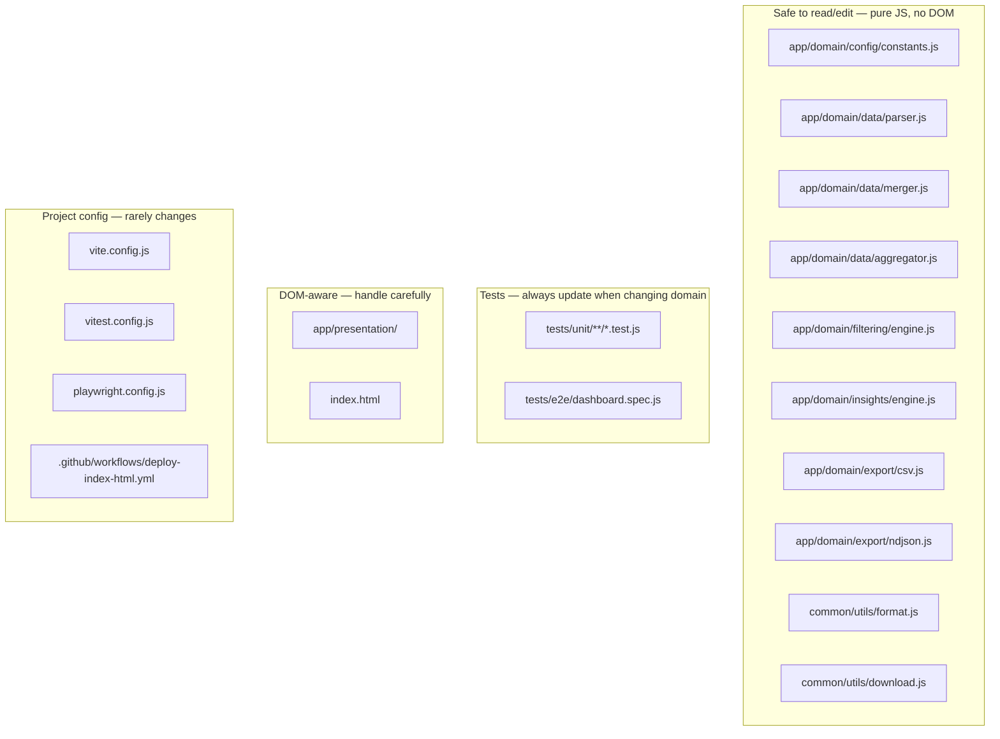

# AGENTS.md

How AI agents and Claude Code skills interact with this codebase. Read alongside `CLAUDE.md` and `docs/architecture.md`.

---

## What this codebase is

A browser-based analytics dashboard for GitHub Copilot Enterprise usage data. It:

- Parses NDJSON exports from the GitHub Copilot API
- Merges overlapping date-range exports without duplicating records
- Aggregates by user, day, IDE, language, feature, and model
- Renders 14 charts, KPI cards, insights, and a data table
- Exports PNG, CSV, and NDJSON from the browser
- Deploys to GitHub Pages via Vite

**Nothing leaves the browser.** There is no backend, no API calls to any server.

---

## Codebase layout for agents

**Domain modules are the best place for agents to work.** They are pure functions: given inputs, return outputs. No side effects, no globals, no DOM — easy to reason about and easy to test.

---

## How agents should approach tasks

### Changing business logic

Business rules live in one place: `app/domain/`. An agent adding or changing a rule should:

1. Read the relevant domain module
2. Write or update the test first (`/tdd` skill)
3. Change the domain function
4. Verify `npm run test` passes

No domain change should touch `index.html` or `app/presentation/`.

### Adding a new chart

Follows the Open/Closed principle — no existing files change:

1. Create `app/presentation/charts/my-chart.js`
2. Add canvas element to `index.html`
3. Register in `app/presentation/charts/index.js`
4. Add a CSV builder to `app/domain/export/csv.js`
5. Add unit test for the CSV builder

An agent doing this should read `docs/development.md` for the exact pattern.

### Adding a new insight type

1. Open `app/domain/insights/engine.js`
2. Add the new block to `generateInsights()` (returns an `Insight` object)
3. Add a test in `tests/unit/domain/insights/engine.test.js`
4. No presentation code changes needed

### Debugging a data issue

Start at `app/domain/data/parser.js` → `merger.js` → `aggregator.js`. All three are pure — you can run them against any NDJSON snippet in a test without spinning up the browser.

### Export issues

CSV and NDJSON builders are in `app/domain/export/`. They receive data slices as arguments. An agent can verify output by calling them directly in a test.

---

## Recommended skills for this codebase

| Skill | When to use it |
|-------|---------------|
| `/tdd` | Any change to domain logic — write the test first, implement until green |
| `/ship` | After a feature is done — lint, build, commit, push, verify Pages deployment |
| `/wrap-up` | End of a long session — save state, flag what's unfinished |
| `/review-feedback` | Applying reviewer notes on a PR — run agents in parallel per comment |
| `/simplify` | After a larger refactor — check for redundant code or missed reuse opportunities |
| `/feature-dev` | Scoped feature work — explore → architect → implement |

---

## SOLID conventions agents must follow

These are load-bearing constraints, not style preferences:

| Constraint | Rule |
|-----------|------|
| Domain purity | `app/domain/**` must never import from `app/presentation/`, `app/state/`, or use `document`/`window` |
| Test coverage | Every domain function must have a unit test. New functions without tests will be rejected in review. |
| Single responsibility | One module, one job. A parser does not aggregate. An aggregator does not filter. |
| Composition over inheritance | No `class extends`. Behaviour is composed via function arguments and HOC-style wrappers. |
| No global state in domain | Domain functions receive data as arguments. They do not read or write `state.*` directly. |

---

## Things agents should NOT do

- Add `Co-Authored-By: Claude` lines to commit messages (hooks may reject them; see `CLAUDE.md`)
- Use `git add -A` or `git add .` blindly — stage specific files
- Modify `.github/workflows/deploy-index-html.yml` without understanding the base path setup in `vite.config.js`
- Add DOM access to any file under `app/domain/`
- Skip tests — if a domain function is changed and no test is updated, something is wrong

---

## Entry points for common agent tasks

| Task | Start here |
|------|-----------|
| Parse logic | `app/domain/data/parser.js` |
| Dedup / merge | `app/domain/data/merger.js` |
| Aggregation dimensions | `app/domain/data/aggregator.js` |
| Filter behaviour | `app/domain/filtering/engine.js` |
| Insight rules | `app/domain/insights/engine.js` |
| CSV output | `app/domain/export/csv.js` |
| Business thresholds | `app/domain/config/constants.js` |
| Feature name mapping | `app/domain/config/constants.js` → `FEATURE_LABELS` |
| State shape | `app/state/store.js` |
| Types (JSDoc) | `common/types/index.js` |
