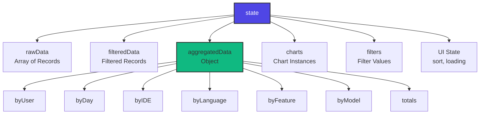
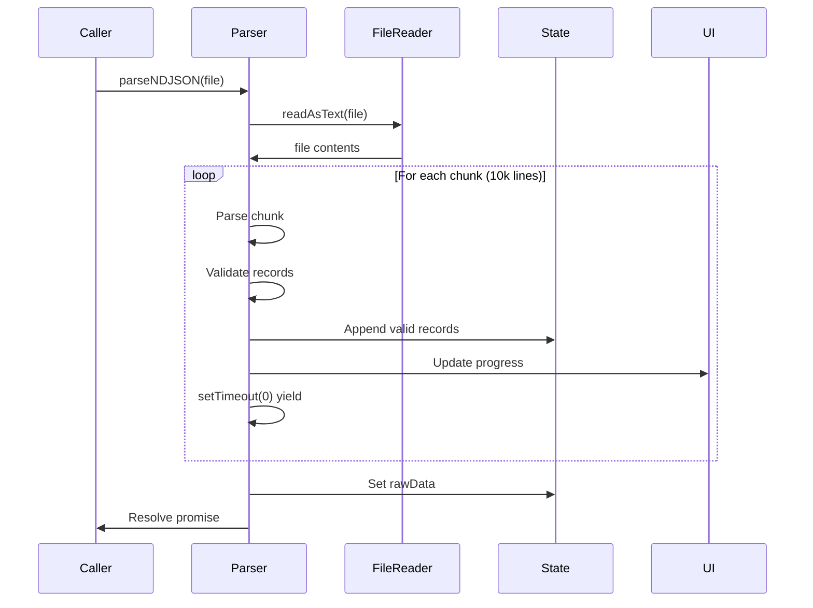
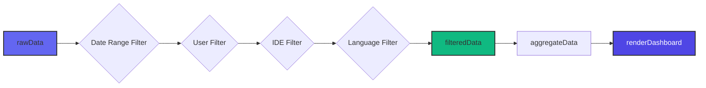
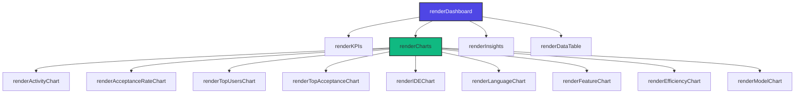
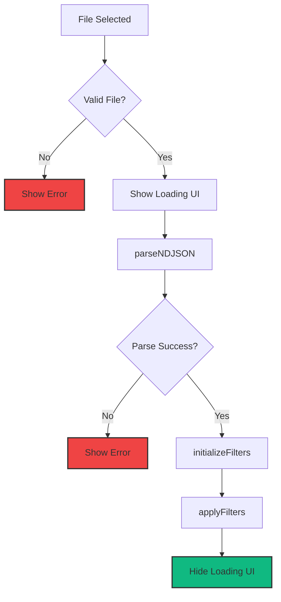

# API Reference

Complete reference for all functions, utilities, and internal APIs in the GitHub Copilot Enterprise Dashboard.

## Table of Contents

- [State Management](#state-management)
- [Parser Functions](#parser-functions)
- [Aggregation Functions](#aggregation-functions)
- [Filter Functions](#filter-functions)
- [Rendering Functions](#rendering-functions)
- [Chart Functions](#chart-functions)
- [Insights Functions](#insights-functions)
- [Utility Functions](#utility-functions)
- [Event Handlers](#event-handlers)

## State Management

### Global State Object

```javascript
const state = {
    rawData: [],              // Original parsed records
    filteredData: [],         // Records after filters applied
    aggregatedData: {},       // Pre-computed aggregations
    charts: {},               // Chart.js instances
    filters: {},              // Current filter values
    sortColumn: null,         // Table sort column
    sortDirection: 'desc',    // Table sort direction
    isLoading: false          // Loading state flag
}
```

### State Structure



## Parser Functions

### parseNDJSON(file)

Parses an NDJSON file in chunks to prevent UI freezing.

**Parameters:**
- `file` (File): The uploaded NDJSON file object

**Returns:**
- `Promise<void>`: Resolves when parsing is complete

**Side Effects:**
- Updates `state.rawData` with parsed records
- Updates progress UI
- Shows error messages for invalid data

**Example:**
```javascript
const file = event.target.files[0];
await parseNDJSON(file);
console.log(`Parsed ${state.rawData.length} records`);
```

**Implementation Flow:**


**Error Handling:**
- Invalid JSON: Skip line, log warning
- Missing required fields: Skip record
- Invalid date format: Skip record
- Negative values: Skip record

### validateRecord(record)

Validates a parsed record against the schema.

**Parameters:**
- `record` (Object): Parsed JSON object

**Returns:**
- `boolean`: `true` if valid, `false` otherwise

**Validation Rules:**
```javascript
{
    required: ['user_login', 'day', 'code_generation_activity_count'],
    dateFormat: /^\d{4}-\d{2}-\d{2}$/,
    numericFields: {
        code_generation_activity_count: { min: 0 },
        code_acceptance_activity_count: { min: 0, max: 'code_generation_activity_count' },
        loc_added_sum: { min: 0 },
        loc_deleted_sum: { min: 0 },
        active_time_minutes: { min: 0 }
    }
}
```

### normalizeRecord(record)

Normalizes a record into internal format.

**Parameters:**
- `record` (Object): Validated record

**Returns:**
- `Object`: Normalized record

**Transformations:**
```javascript
{
    // Rename fields
    code_generation_activity_count → generations
    code_acceptance_activity_count → acceptances
    loc_added_sum → loc_added
    loc_deleted_sum → loc_deleted
    active_time_minutes → active_time

    // Add computed fields
    dateObj: new Date(day)
    net_loc: loc_added - loc_deleted
    acceptance_rate: acceptances / generations

    // Parse nested arrays
    totals_by_ide → ides
    totals_by_language_feature → languages
}
```

## Aggregation Functions

### aggregateData()

Aggregates filtered data into all dimensions.

**Parameters:**
- None (uses `state.filteredData`)

**Returns:**
- `void`

**Side Effects:**
- Updates `state.aggregatedData` with:
  - `byUser`: User-level aggregations
  - `byDay`: Daily aggregations
  - `byIDE`: IDE breakdowns
  - `byLanguage`: Language distributions
  - `byFeature`: Feature usage
  - `byModel`: Model distribution
  - `totals`: Global totals

**Complexity:**
- Time: O(n) where n = number of records
- Space: O(u + d + i + l + f + m) where u=users, d=days, i=IDEs, etc.

**Example:**
```javascript
applyFilters();  // Sets state.filteredData
aggregateData();
console.log(state.aggregatedData.totals.totalGenerations);
// Output: 5000
```

### computeMetrics(aggregation)

Computes derived metrics for an aggregation.

**Parameters:**
- `aggregation` (Object): Aggregation object

**Returns:**
- `Object`: Aggregation with added metrics

**Computed Metrics:**
```javascript
{
    acceptanceRate: totalAcceptances / totalGenerations,
    avgGenerationsPerDay: totalGenerations / days,
    efficiency: acceptanceRate * (totalGenerations / maxGenerations)
}
```

## Filter Functions

### applyFilters()

Applies all active filters to raw data.

**Parameters:**
- None (uses `state.filters` and `state.rawData`)

**Returns:**
- `void`

**Side Effects:**
- Updates `state.filteredData`
- Calls `aggregateData()`
- Calls `renderDashboard()`

**Filter Pipeline:**


**Example:**
```javascript
state.filters.startDate = new Date('2024-01-01');
state.filters.endDate = new Date('2024-01-31');
state.filters.selectedUsers = ['alice', 'bob'];

applyFilters();
// filteredData now contains only alice and bob's records from January
```

### initializeFilters()

Sets up filter dropdowns with available options.

**Parameters:**
- None

**Returns:**
- `void`

**Side Effects:**
- Populates user dropdown
- Populates IDE dropdown
- Populates language dropdown
- Sets default date range

**Example:**
```javascript
initializeFilters();
// Dropdowns now contain all unique users, IDEs, languages from rawData
```

## Rendering Functions

### renderDashboard()

Master rendering function that coordinates all UI updates.

**Parameters:**
- None

**Returns:**
- `void`

**Side Effects:**
- Calls `renderKPIs()`
- Calls `renderCharts()`
- Calls `renderInsights()`
- Calls `renderDataTable()`

**Rendering Flow:**


### renderKPIs()

Renders KPI metric cards.

**Parameters:**
- None

**Returns:**
- `void`

**KPIs Rendered:**
1. Total Generations
2. Average Acceptance Rate
3. Active Users
4. Lines of Code Added
5. Lines of Code Deleted
6. Net Lines of Code
7. Total Active Time

**Example:**
```javascript
renderKPIs();
// DOM updated with 7 KPI cards displaying metrics
```

### renderDataTable()

Renders the data table with user records.

**Parameters:**
- None

**Returns:**
- `void`

**Features:**
- Displays first 500 rows (configurable via `CONFIG.MAX_TABLE_ROWS`)
- Sortable columns
- Shows truncation message if data exceeds limit

**Table Columns:**
- User
- Date
- Generations
- Acceptances
- Acceptance Rate %
- Lines Added
- Lines Deleted
- Net Lines

## Chart Functions

### getChartOptions(type, customOptions)

Returns Chart.js options with consistent theming.

**Parameters:**
- `type` (string): Chart type ('line', 'bar', 'pie', 'doughnut', 'scatter')
- `customOptions` (Object): Custom options to merge (optional)

**Returns:**
- `Object`: Chart.js options object

**Example:**
```javascript
const options = getChartOptions('line', {
    scales: {
        y: {
            beginAtZero: true,
            max: 100
        }
    }
});
```

**Default Options:**
```javascript
{
    responsive: true,
    maintainAspectRatio: false,
    animation: { duration: CONFIG.CHART_ANIMATION_DURATION },
    plugins: {
        legend: { labels: { color: '#f8fafc' } },
        tooltip: { backgroundColor: 'rgba(15, 23, 42, 0.9)' }
    },
    scales: {  // for line/bar charts
        x: { grid: { color: 'rgba(51, 65, 85, 0.5)' } },
        y: { grid: { color: 'rgba(51, 65, 85, 0.5)' } }
    }
}
```

### renderActivityChart()

Renders activity timeline chart (multi-line).

**Chart Type:** Line
**Data Sources:**
- `state.aggregatedData.byDay`

**Datasets:**
1. Generations (blue line)
2. Acceptances (green line)
3. Chat Activity (purple line)

**X-Axis:** Dates
**Y-Axis:** Count

### renderAcceptanceRateChart()

Renders acceptance rate trend with moving average.

**Chart Type:** Area
**Data Sources:**
- `state.aggregatedData.byDay`

**Datasets:**
1. Daily acceptance rate
2. 7-day moving average

**Features:**
- Color gradient fill
- Moving average smoothing

### renderTopUsersChart()

Renders top users by generations (horizontal bar).

**Chart Type:** Horizontal Bar
**Data Sources:**
- `state.aggregatedData.byUser` (sorted, limited to top N)

**Features:**
- Color-coded by acceptance rate:
  - Green: High (>70%)
  - Orange: Medium (20-70%)
  - Red: Low (<20%)
- Limited to `CONFIG.MAX_TOP_USERS_SHOWN`

### renderTopAcceptanceChart()

Renders top users by acceptance rate (horizontal bar).

**Chart Type:** Horizontal Bar
**Data Sources:**
- `state.aggregatedData.byUser` (filtered by min generations)

**Filters:**
- Only users with >= `CONFIG.MIN_GENERATIONS_FOR_RATE` generations

### renderIDEChart()

Renders IDE market share (doughnut).

**Chart Type:** Doughnut
**Data Sources:**
- `state.aggregatedData.byIDE`

**Features:**
- Percentage labels
- Color scheme per IDE

### renderLanguageChart()

Renders language distribution (doughnut).

**Chart Type:** Doughnut
**Data Sources:**
- `state.aggregatedData.byLanguage`

**Features:**
- Top N languages + "Other"
- Limited to `CONFIG.MAX_LANGUAGES_SHOWN`

### renderFeatureChart()

Renders feature usage (bar).

**Chart Type:** Bar
**Data Sources:**
- `state.aggregatedData.byFeature`

### renderEfficiencyChart()

Renders user efficiency matrix (scatter).

**Chart Type:** Scatter
**Data Sources:**
- `state.aggregatedData.byUser`

**Axes:**
- X: Total generations
- Y: Acceptance rate

**Features:**
- Point size = total active time
- Color = acceptance rate tier

### renderModelChart()

Renders model distribution (pie).

**Chart Type:** Pie
**Data Sources:**
- `state.aggregatedData.byModel`

## Insights Functions

### generateInsights()

Generates automated insights from data.

**Parameters:**
- None

**Returns:**
- `Array<Insight>`: Array of insight objects

**Insight Types Detected:**
1. Power Users (top percentile)
2. High Efficiency Users (>70% acceptance)
3. Low Acceptance Alerts (<20% acceptance)
4. Quota Exceeded Days (>500 gens/day)
5. Week-over-Week Trends
6. Zero Acceptance Days

**Insight Object:**
```javascript
{
    type: 'success' | 'warning' | 'error' | 'info',
    icon: 'lucide-icon-name',
    title: 'Insight Title',
    description: 'Detailed description',
    value: 'Display value',
    users: ['alice', 'bob']  // optional
}
```

**Example:**
```javascript
const insights = generateInsights();
insights.forEach(insight => {
    console.log(`[${insight.type}] ${insight.title}: ${insight.description}`);
});
```

## Utility Functions

### formatNumber(num)

Formats large numbers with K/M suffixes.

**Parameters:**
- `num` (number): Number to format

**Returns:**
- `string`: Formatted number

**Examples:**
```javascript
formatNumber(1234)      // "1.2K"
formatNumber(1234567)   // "1.2M"
formatNumber(123)       // "123"
formatNumber(0)         // "0"
```

### formatDate(date)

Formats Date object to string.

**Parameters:**
- `date` (Date): Date object

**Returns:**
- `string`: Formatted date (YYYY-MM-DD)

**Example:**
```javascript
formatDate(new Date('2024-01-15'))  // "2024-01-15"
```

### formatPercentage(value, decimals)

Formats decimal as percentage.

**Parameters:**
- `value` (number): Decimal value (0-1)
- `decimals` (number): Decimal places (default: 1)

**Returns:**
- `string`: Percentage string

**Examples:**
```javascript
formatPercentage(0.755)      // "75.5%"
formatPercentage(0.755, 2)   // "75.50%"
formatPercentage(1)          // "100.0%"
```

### calculateMovingAverage(data, window)

Calculates moving average.

**Parameters:**
- `data` (Array<number>): Data points
- `window` (number): Window size

**Returns:**
- `Array<number>`: Moving averages

**Example:**
```javascript
const data = [10, 20, 30, 40, 50];
const ma = calculateMovingAverage(data, 3);
// Result: [10, 15, 20, 30, 40]
```

### sortTable(column)

Sorts data table by column.

**Parameters:**
- `column` (string): Column name to sort by

**Returns:**
- `void`

**Side Effects:**
- Updates `state.sortColumn`
- Updates `state.sortDirection`
- Re-renders table

**Example:**
```javascript
sortTable('generations');  // Sort by generations descending
sortTable('generations');  // Toggle to ascending
```

### exportToCSV()

Exports filtered data to CSV file.

**Parameters:**
- None

**Returns:**
- `void`

**Side Effects:**
- Creates CSV blob
- Triggers file download

**CSV Format:**
```csv
User,Date,Generations,Acceptances,Acceptance Rate %,Lines Added,Lines Deleted,Net Lines
alice,2024-01-15,45,32,71.1,234,87,147
```

**Example:**
```javascript
exportToCSV();
// Downloads "copilot-analytics-YYYY-MM-DD.csv"
```

## Event Handlers

### handleFileUpload(event)

Handles file input change event.

**Parameters:**
- `event` (Event): File input change event

**Returns:**
- `void`

**Flow:**


### handleFilterChange(filterType, value)

Handles filter dropdown changes.

**Parameters:**
- `filterType` (string): Filter name ('user', 'ide', 'language', 'dateRange')
- `value` (any): New filter value

**Returns:**
- `void`

**Side Effects:**
- Updates `state.filters[filterType]`
- Calls `applyFilters()`

### handleQuickRange(days)

Handles quick range button clicks.

**Parameters:**
- `days` (number): Number of days (7, 30, 90)

**Returns:**
- `void`

**Side Effects:**
- Sets `state.filters.startDate` to `today - days`
- Sets `state.filters.endDate` to `today`
- Calls `applyFilters()`

## Type Definitions

### Record Type

```typescript
interface Record {
    user_login: string;
    day: string;
    dateObj: Date;
    generations: number;
    acceptances: number;
    chat: number;
    loc_added: number;
    loc_deleted: number;
    net_loc: number;
    active_time: number;
    acceptance_rate: number;
    ides: Array<{ide: string, generations: number}>;
    languages: Array<{language: string, generations: number}>;
    features: Array<{feature: string, generations: number}>;
    models: Array<{model: string, generations: number}>;
}
```

### Aggregation Type

```typescript
interface UserAggregation {
    user: string;
    totalGenerations: number;
    totalAcceptances: number;
    totalChat: number;
    totalLocAdded: number;
    totalLocDeleted: number;
    totalNetLoc: number;
    totalActiveTime: number;
    acceptanceRate: number;
    days: number;
    avgGenerationsPerDay: number;
}
```

## Next Steps

- **[Development Guide](./development.md)** - Use these APIs to build features
- **[Architecture](./architecture.md)** - Understand the system design
- **[Data Schema](./data-schema.md)** - Data structure reference
