# Architecture

This document describes the system architecture, design patterns, and data flow of the GitHub Copilot Enterprise Dashboard.

## Table of Contents

- [High-Level Architecture](#high-level-architecture)
- [Data Flow](#data-flow)
- [Component Architecture](#component-architecture)
- [State Management](#state-management)
- [Performance Architecture](#performance-architecture)
- [Chart Architecture](#chart-architecture)

## High-Level Architecture

The dashboard follows a **single-file, zero-dependency architecture** optimized for enterprise deployment.

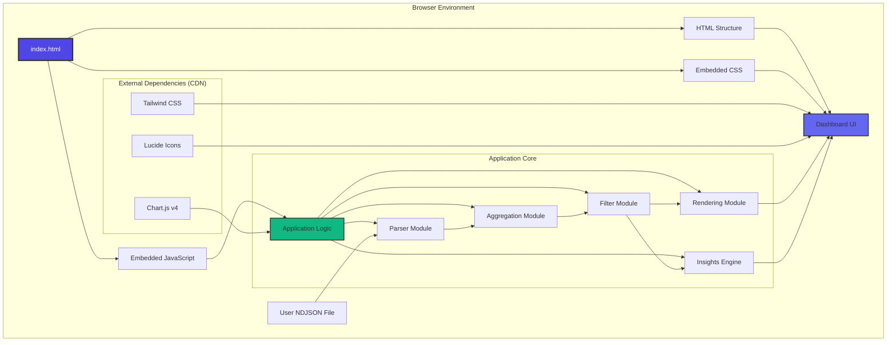

### Key Architectural Principles

1. **Zero Build Process** - Direct browser execution, no compilation needed
2. **No Backend Required** - 100% client-side processing for data privacy
3. **CDN Dependencies** - External libraries loaded from CDN for simplicity
4. **Monolithic Structure** - Single file for easy deployment and version control
5. **Responsive Design** - Works on desktop, tablet, and mobile devices

## Data Flow

### Complete Data Processing Pipeline

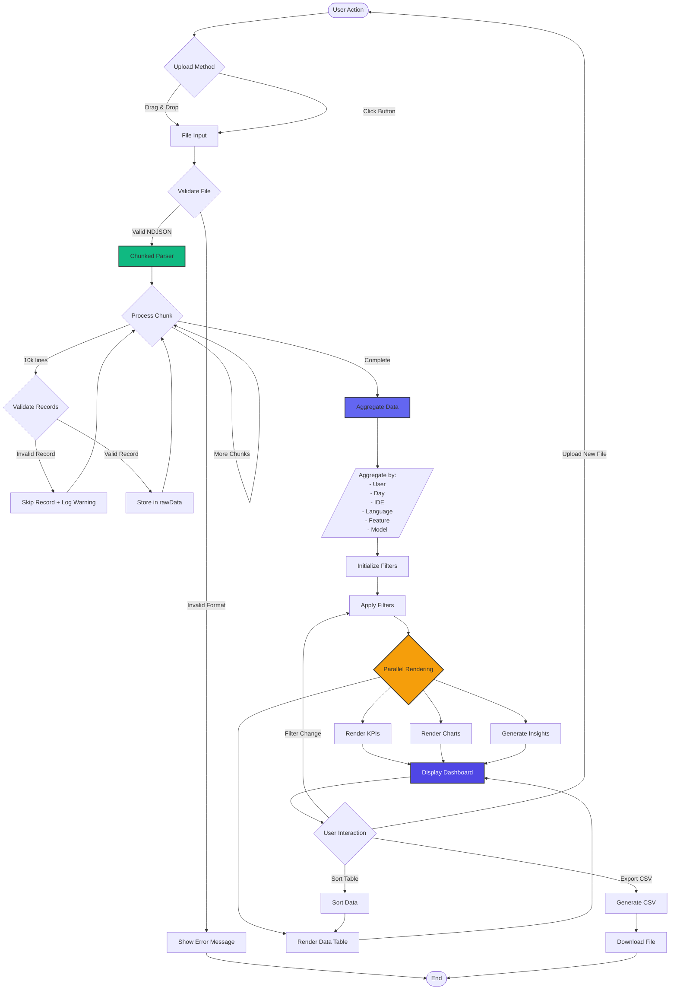

### Chunked Parsing Strategy

Large files are processed in chunks to prevent UI freezing:

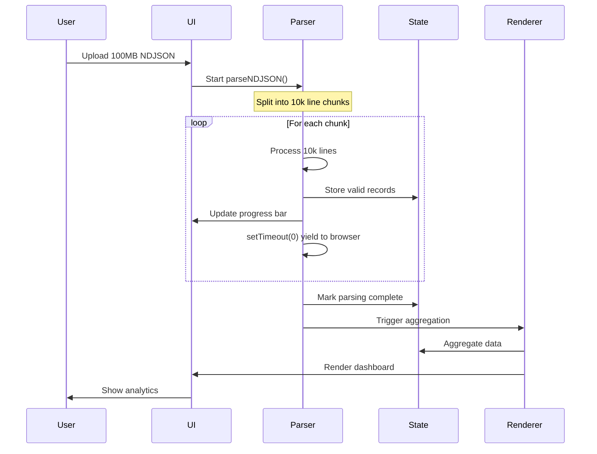

## Component Architecture

### Module Organization

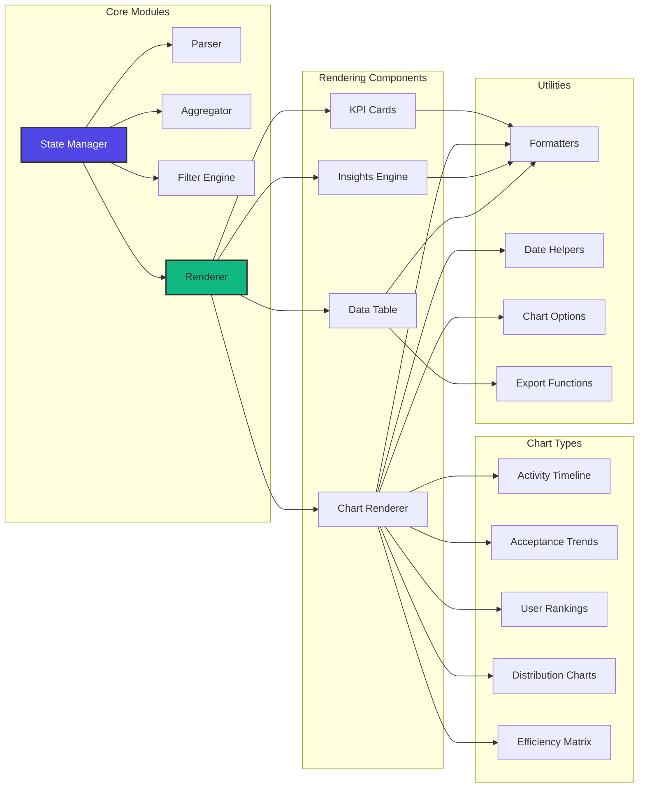

### Component Responsibilities

| Component | Responsibility | Key Functions |
|-----------|---------------|---------------|
| **Parser** | NDJSON parsing, validation | `parseNDJSON()`, `validateRecord()` |
| **Aggregator** | Data aggregation, rollups | `aggregateData()`, `computeMetrics()` |
| **Filter Engine** | Apply user filters | `applyFilters()`, `updateFilterUI()` |
| **Renderer** | Coordinate all rendering | `renderDashboard()`, `renderCharts()` |
| **KPI Cards** | Metric summaries | `renderKPIs()`, `calculateKPI()` |
| **Chart Renderer** | Visualization creation | `renderActivityChart()`, `renderTopUsers()` |
| **Insights Engine** | Anomaly detection | `generateInsights()`, `detectPowerUsers()` |
| **Data Table** | Tabular display | `renderDataTable()`, `sortTable()` |

## State Management

### Global State Structure

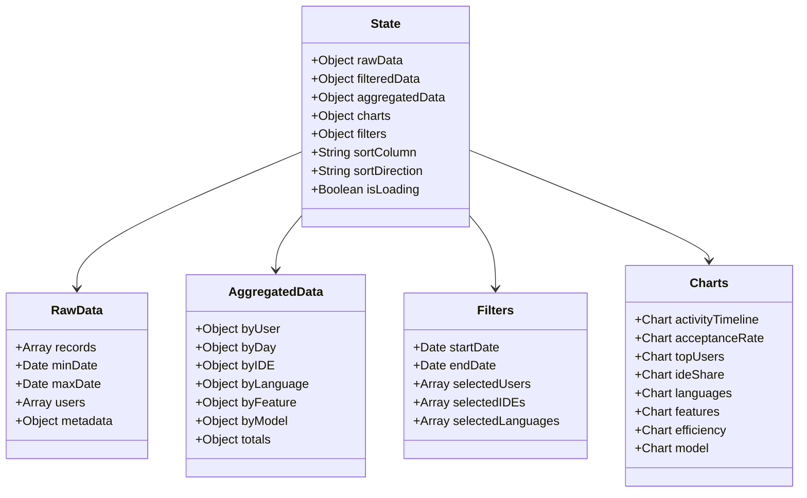

### State Update Flow

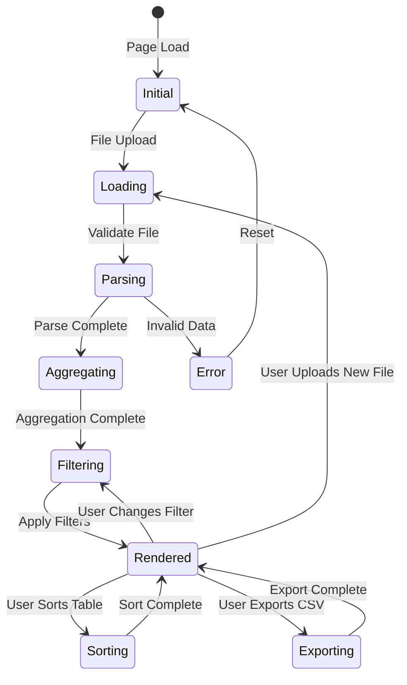

## Performance Architecture

### Optimization Strategies

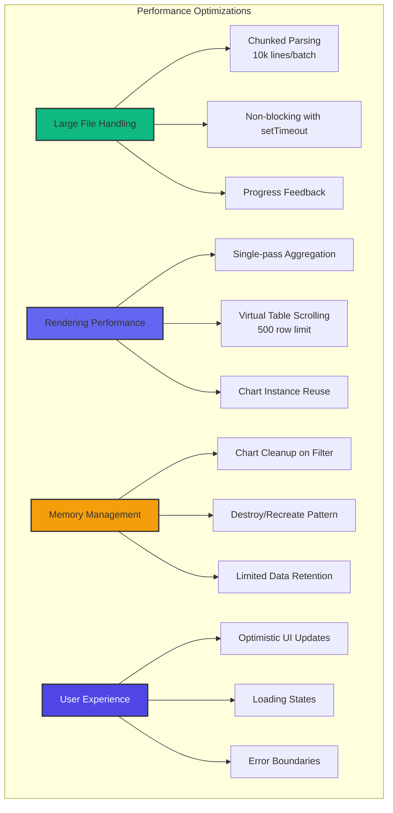

### Performance Metrics

| Operation | Target | Strategy |
|-----------|--------|----------|
| **Parse 100MB file** | < 10s | Chunked processing (10k lines) |
| **Filter change** | < 500ms | Pre-aggregated data |
| **Chart render** | < 300ms | Optimized Chart.js config |
| **Table sort** | < 100ms | In-memory sort, limited rows |
| **CSV export** | < 2s | Blob API, async processing |

## Chart Architecture

### Chart Rendering Pipeline

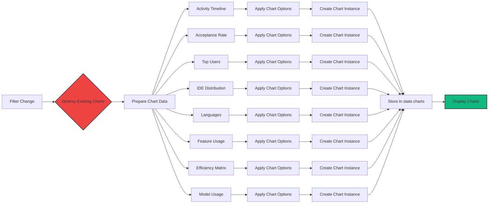

### Chart Type Overview

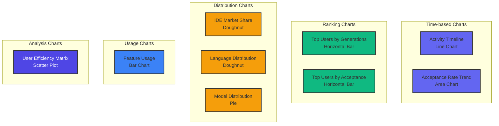

## Extension Points

The architecture supports extensibility through well-defined interfaces:

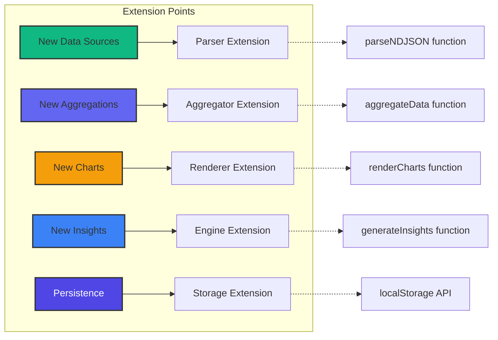

See [Development Guide](./development.md) for detailed extension instructions.

## Security Considerations

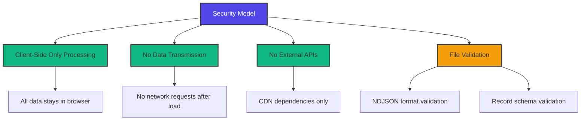

## Next Steps

- **[Data Schema](./data-schema.md)** - Understand the NDJSON data structure
- **[Configuration](./configuration.md)** - Customize thresholds and settings
- **[Development Guide](./development.md)** - Start building extensions
