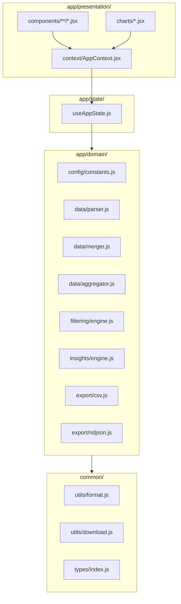
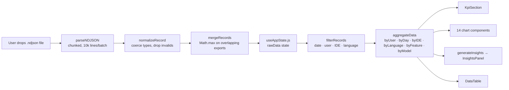
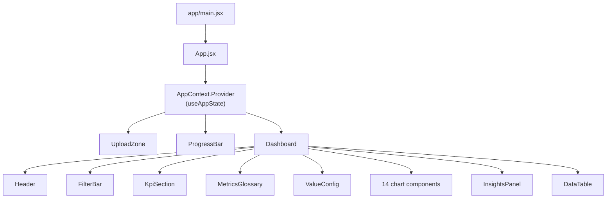
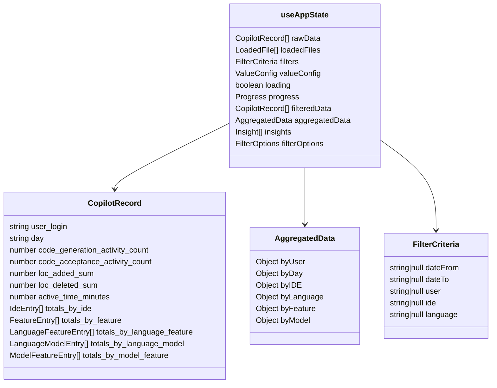

# Architecture

## Layers

The codebase follows Clean Architecture. Domain logic is pure JavaScript with no DOM dependencies. The presentation layer is React components that read from a central hook and pass data down as props.



Domain modules have **no imports from `app/state/` or `app/presentation/`**. They receive data as arguments and return values — this is what makes them testable in Node without a browser.

---

## Data Flow



Files are parsed once and stored in `rawData`. Every filter change re-runs `filterRecords → aggregateData → render`. No caching — the single-pass aggregation is fast enough for the dataset sizes involved.

---

## React Component Tree



`App` renders one of three top-level views based on state: `UploadZone` (no data), `ProgressBar` (loading), or `Dashboard` (data loaded).

---

## State Shape



`filteredData`, `aggregatedData`, `insights`, and `filterOptions` are derived synchronously from `rawData` + `filters` on every render — no separate dispatch step.

---

## NDJSON Schema

The real GitHub Copilot Enterprise export format (as of late 2025):

```json
{
  "report_start_day": "2025-11-19",
  "report_end_day": "2025-12-16",
  "day": "2025-12-07",
  "enterprise_id": "5429",
  "user_id": 12345678,
  "user_login": "octocat",
  "user_initiated_interaction_count": 40,
  "code_generation_activity_count": 101,
  "code_acceptance_activity_count": 4,
  "loc_suggested_to_add_sum": 617,
  "loc_suggested_to_delete_sum": 0,
  "loc_added_sum": 2452,
  "loc_deleted_sum": 93,
  "used_agent": true,
  "used_chat": true,
  "totals_by_ide": [...],
  "totals_by_feature": [...],
  "totals_by_language_feature": [...],
  "totals_by_language_model": [...],
  "totals_by_model_feature": [...]
}
```

**Field notes:**
- `loc_suggested_to_add_sum` — lines Copilot suggested (ghost text shown)
- `loc_added_sum` — lines actually accepted/applied (what landed in the file)
- `active_time_minutes` — not present in current API exports; parser defaults to 0
- `model` — not a root-level field; model info is in `totals_by_language_model` and `totals_by_model_feature`
- `user_initiated_interaction_count` — user-triggered chat/agent interactions (not passive completions)

---

## SOLID in Practice

| Principle | Where it shows up |
|-----------|-------------------|
| **Single Responsibility** | Each module has one job: `parser.js` parses, `merger.js` merges, `aggregator.js` aggregates. None of them render or touch the DOM. |
| **Open/Closed** | New insight: add a block to `insights/engine.js`, no existing code changes. New chart: add a JSX component under `presentation/charts/`. |
| **Liskov** | Not directly applicable (no inheritance). Composition used throughout. |
| **Interface Segregation** | Domain functions take only the data slice they need — `filterRecords(records, criteria)` doesn't receive the whole state. |
| **Dependency Inversion** | Domain modules depend on `common/utils/format.js`, not on browser APIs. The React layer wires the browser into the domain by passing callbacks (`onProgress`). |
