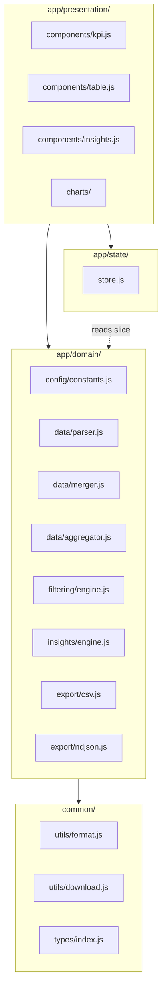
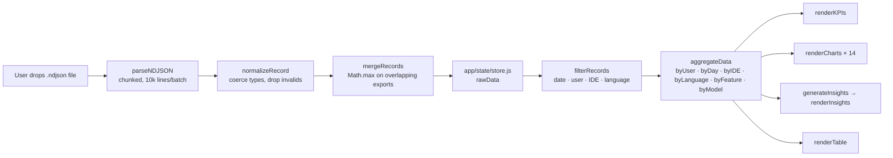
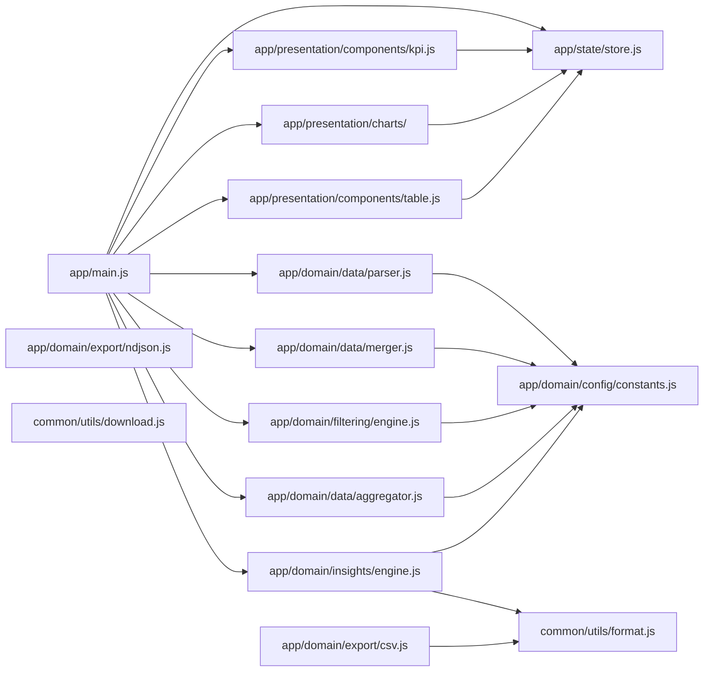
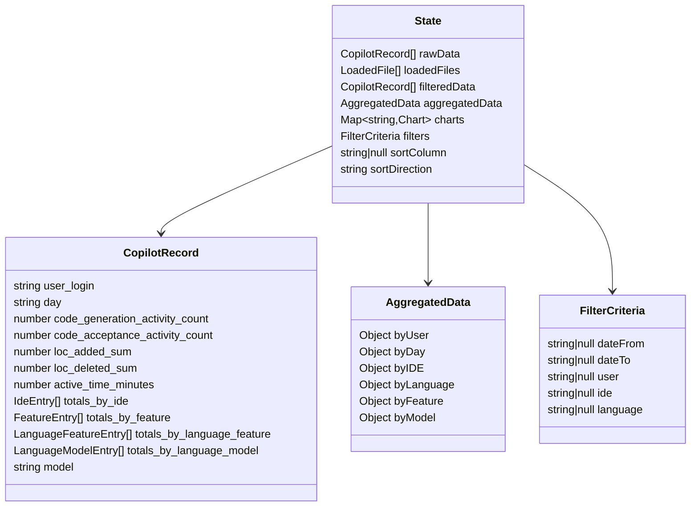

# Architecture

## Layers

The codebase follows Clean Architecture: domain logic is pure JavaScript with no DOM dependencies; the presentation layer is a thin shell that reads from the state store and calls domain functions.

Domain modules have **no imports from `app/state/` or `app/presentation/`**. They receive data as arguments and return values — this is what makes them testable in Node without a browser.

---

## Data Flow

Files go through the parser once. Every filter change re-runs `filterRecords → aggregateData → render`. No caching layer — the single-pass aggregation is fast enough for the dataset sizes involved.

---

## Module Map

---

## State Shape

---

## SOLID in Practice

| Principle | Where it shows up |
|-----------|-------------------|
| **Single Responsibility** | Each module has one job: `parser.js` parses, `merger.js` merges, `aggregator.js` aggregates. None of them render or touch the DOM. |
| **Open/Closed** | New insight types: add a function to `insights/engine.js`, no existing code changes. New chart: add a module under `presentation/charts/`, register it. |
| **Liskov** | Not directly applicable (no inheritance hierarchy). Composition used instead. |
| **Interface Segregation** | Domain functions take only the data slice they need — `filterRecords(records, criteria)` doesn't receive the whole state. |
| **Dependency Inversion** | Domain modules depend on `common/utils/format.js` (abstraction), not on browser APIs. The presentation layer wires the browser into the domain by passing callbacks (e.g. `onProgress`). |
