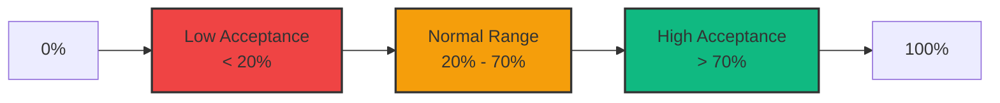
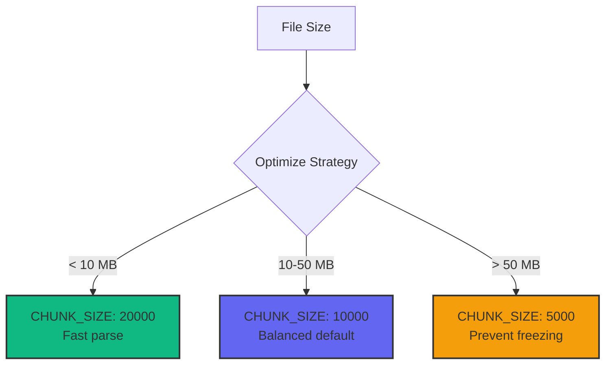

# Configuration

This guide covers all configuration options and customization settings for the GitHub Copilot Enterprise Dashboard.

## Table of Contents

- [CONFIG Object Reference](#config-object-reference)
- [Threshold Configuration](#threshold-configuration)
- [Visual Customization](#visual-customization)
- [Performance Tuning](#performance-tuning)
- [Chart Configuration](#chart-configuration)
- [Advanced Configuration](#advanced-configuration)

## CONFIG Object Reference

All business logic thresholds and settings are centralized in the `CONFIG` object (lines ~550-575 in `index.html`).

### Complete Configuration

```javascript
const CONFIG = {
    // ===== Threshold Settings =====
    DAILY_GENERATION_QUOTA: 500,           // Alert when user exceeds this many generations per day
    LOW_ACCEPTANCE_THRESHOLD: 0.20,        // 20% - Flag users below this acceptance rate
    HIGH_ACCEPTANCE_THRESHOLD: 0.70,       // 70% - Badge users above this acceptance rate
    POWER_USER_PERCENTILE: 0.90,           // Top 10% - Identify power users
    MIN_GENERATIONS_FOR_RATE: 50,          // Minimum generations required for meaningful acceptance rate
    TREND_COMPARISON_DAYS: 7,             // Days window for week-over-week trend comparison

    // ===== Chart Settings =====
    CHART_ANIMATION_DURATION: 750,         // Animation duration in milliseconds
    MAX_TOP_USERS_SHOWN: 15,               // Number of users in "Top Users" chart
    MAX_LANGUAGES_SHOWN: 10,               // Number of languages before grouping into "Other"

    // ===== Performance Settings =====
    CHUNK_SIZE: 10000,                     // Lines to process per parsing chunk
    MAX_FILE_SIZE_MB: 100,                 // Warning threshold for large file uploads
    TABLE_PAGE_SIZE: 100,                  // Rows per page multiplier (table shows PAGE_SIZE × 5)

    // ===== Value Calculation Settings =====
    BLENDED_RATE_PER_HOUR: 90,            // $/hour per developer (overridable via UI)
    MANUAL_LINES_PER_HOUR: 30,            // Average lines coded manually per hour (overridable via UI)
};
```

## Threshold Configuration

### User Performance Thresholds

Configure when users are flagged for performance issues or excellence:



#### DAILY_GENERATION_QUOTA

**Default:** `500`

Maximum reasonable daily generations per user. Exceeding this triggers an insight alert.

```javascript
// Conservative limit
DAILY_GENERATION_QUOTA: 300

// Standard limit (default)
DAILY_GENERATION_QUOTA: 500

// Generous limit for power users
DAILY_GENERATION_QUOTA: 1000
```

**Use Cases:**
- Detect potential quota abuse
- Identify exceptionally active days
- Monitor API usage patterns

#### LOW_ACCEPTANCE_THRESHOLD

**Default:** `0.20` (20%)

Users below this acceptance rate are flagged for review.

```javascript
// Strict threshold
LOW_ACCEPTANCE_THRESHOLD: 0.30  // 30%

// Standard (default)
LOW_ACCEPTANCE_THRESHOLD: 0.20  // 20%

// Lenient
LOW_ACCEPTANCE_THRESHOLD: 0.10  // 10%
```

**Impact:**
- Insights panel: "⚠️ Low Acceptance Rate" alerts
- User ranking chart: Red color coding
- Efficiency matrix: Bottom quadrant highlighting

#### HIGH_ACCEPTANCE_THRESHOLD

**Default:** `0.70` (70%)

Users above this rate receive excellence badges.

```javascript
// Very high bar
HIGH_ACCEPTANCE_THRESHOLD: 0.80  // 80%

// Standard (default)
HIGH_ACCEPTANCE_THRESHOLD: 0.70  // 70%

// Achievable target
HIGH_ACCEPTANCE_THRESHOLD: 0.60  // 60%
```

**Impact:**
- Insights panel: "✅ High Efficiency Users"
- User ranking chart: Green color coding
- Recognition reporting

#### POWER_USER_PERCENTILE

**Default:** `0.90` (Top 10%)

Percentile threshold for identifying power users.

```javascript
// Top 5% only
POWER_USER_PERCENTILE: 0.95

// Top 10% (default)
POWER_USER_PERCENTILE: 0.90

// Top 20%
POWER_USER_PERCENTILE: 0.80
```

**Impact:**
- Insights panel: "⭐ Power Users" section
- Special highlighting in visualizations

#### MIN_GENERATIONS_FOR_RATE

**Default:** `50`

Minimum generations required before calculating acceptance rate.

```javascript
// Very strict (high confidence)
MIN_GENERATIONS_FOR_RATE: 100

// Standard (default)
MIN_GENERATIONS_FOR_RATE: 50

// Lenient (more users included)
MIN_GENERATIONS_FOR_RATE: 20
```

**Why This Matters:**
- Prevents misleading rates from low sample sizes
- A user with 2 generations and 2 acceptances (100% rate) isn't statistically significant
- Filters "Top Users by Acceptance" chart

## Visual Customization

### Color Palette

Edit CSS `:root` variables (lines ~18-31):

```css
:root {
    /* Dark Mode (Default) */
    --slate-900: #0f172a;    /* Background dark */
    --slate-800: #1e293b;    /* Card background */
    --slate-700: #334155;    /* Borders */
    --slate-400: #94a3b8;    /* Muted text */
    --slate-50: #f8fafc;     /* Primary text */

    /* Accent Colors */
    --indigo-600: #4f46e5;   /* Primary buttons */
    --indigo-500: #6366f1;   /* Hover states */
    --indigo-400: #818cf8;   /* Active states */

    /* Status Colors */
    --emerald-500: #10b981;  /* Success */
    --amber-500: #f59e0b;    /* Warning */
    --red-500: #ef4444;      /* Error */
    --blue-500: #3b82f6;     /* Info */
}
```

#### Light Mode Example

```css
:root {
    --slate-900: #f8fafc;    /* Light background */
    --slate-800: #ffffff;    /* White cards */
    --slate-700: #e2e8f0;    /* Light borders */
    --slate-400: #64748b;    /* Darker text */
    --slate-50: #0f172a;     /* Dark text */
    /* ... keep accent colors the same ... */
}
```

### Chart Colors

Modify chart color schemes in individual render functions:

```javascript
// Example: Activity Timeline colors
datasets: [
    {
        label: 'Generations',
        borderColor: '#6366f1',      // Indigo
        backgroundColor: 'rgba(99, 102, 241, 0.1)',
        // ...
    },
    {
        label: 'Acceptances',
        borderColor: '#10b981',      // Emerald
        backgroundColor: 'rgba(16, 185, 129, 0.1)',
        // ...
    }
]
```

### Typography

```css
body {
    font-family: -apple-system, BlinkMacSystemFont, 'Segoe UI',
                 Roboto, Oxygen, Ubuntu, Cantarell, sans-serif;
}

/* Custom Font Example */
@import url('https://fonts.googleapis.com/css2?family=Inter:wght@400;500;600;700&display=swap');

body {
    font-family: 'Inter', sans-serif;
}
```

## Performance Tuning

### Parsing Performance



#### CHUNK_SIZE

**Default:** `10000`

Lines to process per chunk during NDJSON parsing.

```javascript
// Small files (< 10 MB) - faster parsing
CHUNK_SIZE: 20000

// Large files (> 50 MB) - smoother UI
CHUNK_SIZE: 5000

// Balanced (default)
CHUNK_SIZE: 10000
```

**Trade-offs:**
- **Larger chunks:** Faster total parse time, potential UI freezing
- **Smaller chunks:** Slower parse, smoother progress updates

### Chart Performance

#### CHART_ANIMATION_DURATION

**Default:** `750` (ms)

Animation duration for chart rendering.

```javascript
// No animation (fastest)
CHART_ANIMATION_DURATION: 0

// Quick (default)
CHART_ANIMATION_DURATION: 750

// Smooth/slow
CHART_ANIMATION_DURATION: 1500
```

## Chart Configuration

### Display Limits

#### MAX_TOP_USERS_SHOWN

**Default:** `15`

Number of users displayed in ranking charts.

```javascript
// Top 10
MAX_TOP_USERS_SHOWN: 10

// Top 15 (default)
MAX_TOP_USERS_SHOWN: 15

// Top 20
MAX_TOP_USERS_SHOWN: 20
```

#### MAX_LANGUAGES_SHOWN

**Default:** `10`

Languages shown before grouping remainder into "Other".

```javascript
// Minimal
MAX_LANGUAGES_SHOWN: 5

// Standard (default)
MAX_LANGUAGES_SHOWN: 10

// Comprehensive
MAX_LANGUAGES_SHOWN: 15
```

### Chart Options Template

All charts use a shared options template via `getChartOptions()`:

```javascript
function getChartOptions(title) {
    return {
        responsive: true,
        maintainAspectRatio: false,
        animation: { duration: CONFIG.CHART_ANIMATION_DURATION },
        plugins: {
            legend: { labels: { color: '#94a3b8' } },
            title: { display: false }
        },
        scales: {
            y: { ticks: { color: '#94a3b8' }, grid: { color: '#334155' } },
            x: { ticks: { color: '#94a3b8' }, grid: { color: '#334155' } }
        }
    };
}
```

## Configuration Best Practices

### 1. Environment-Specific Configs

```javascript
// Faster iteration (disable animation)
const CONFIG = {
    CHUNK_SIZE: 5000,
    CHART_ANIMATION_DURATION: 0,
    TABLE_PAGE_SIZE: 20
};

// Production defaults
const CONFIG = {
    CHUNK_SIZE: 10000,
    CHART_ANIMATION_DURATION: 750,
    TABLE_PAGE_SIZE: 100
};
```

### 2. Organization-Specific Thresholds

```javascript
// Enterprise with high Copilot usage
const CONFIG = {
    DAILY_GENERATION_QUOTA: 1000,
    LOW_ACCEPTANCE_THRESHOLD: 0.30,
    HIGH_ACCEPTANCE_THRESHOLD: 0.75,
    POWER_USER_PERCENTILE: 0.95
};

// Small team getting started
const CONFIG = {
    DAILY_GENERATION_QUOTA: 200,
    LOW_ACCEPTANCE_THRESHOLD: 0.15,
    HIGH_ACCEPTANCE_THRESHOLD: 0.60,
    POWER_USER_PERCENTILE: 0.80
};
```

### 3. Performance vs Visual Quality

```javascript
// High-end devices
const CONFIG = {
    CHUNK_SIZE: 20000,
    TABLE_PAGE_SIZE: 200,
    CHART_ANIMATION_DURATION: 1000
};

// Low-end devices
const CONFIG = {
    CHUNK_SIZE: 5000,
    TABLE_PAGE_SIZE: 50,
    CHART_ANIMATION_DURATION: 300
};
```

## Testing Your Configuration

After changing configuration values:

1. **Clear browser cache** - Ensure latest version loads
2. **Test with sample data** - Verify behavior changes
3. **Check browser console** - Look for warnings/errors
4. **Test edge cases** - Large files, empty datasets, filters
5. **Validate insights** - Ensure thresholds trigger correctly

## Next Steps

- **[Development Guide](./development.md)** - Extend functionality
- **[Architecture](./architecture.md)** - Understand internals
- **[Troubleshooting](./troubleshooting.md)** - Fix common issues
