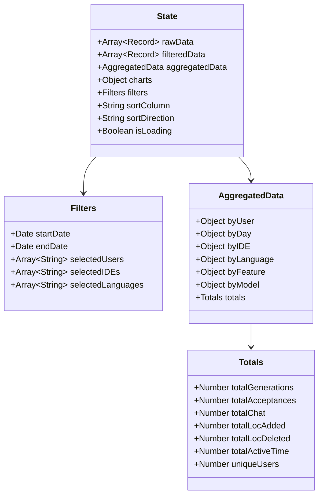
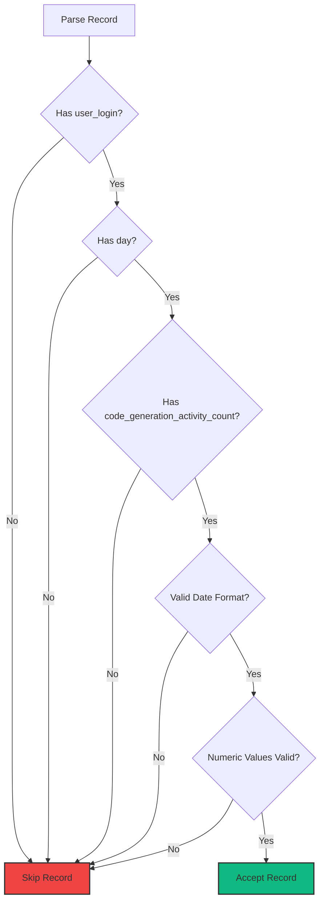

# Data Schema

Complete reference for the GitHub Copilot Enterprise NDJSON data format and internal data structures.

## Table of Contents

- [NDJSON Input Format](#ndjson-input-format)
- [Record Schema](#record-schema)
- [Internal Data Structures](#internal-data-structures)
- [Aggregated Data Format](#aggregated-data-format)
- [Validation Rules](#validation-rules)
- [Data Examples](#data-examples)

## NDJSON Input Format

### File Format

GitHub Copilot Enterprise exports usage data as **NDJSON** (Newline Delimited JSON):

```
{"user_login":"alice","day":"2024-01-15","code_generation_activity_count":45,...}
{"user_login":"bob","day":"2024-01-15","code_generation_activity_count":32,...}
{"user_login":"alice","day":"2024-01-16","code_generation_activity_count":38,...}
```

**Format Rules:**
- One JSON object per line
- No commas between objects
- Each line must be valid JSON
- Empty lines are ignored
- Lines starting with `//` or `#` are treated as comments (optional extension)

### Data Flow


## Record Schema

### Core Record Structure

```typescript
interface CopilotRecord {
    // User identification
    user_login: string;                      // GitHub username
    day: string;                             // ISO date: "YYYY-MM-DD"

    // Activity metrics
    code_generation_activity_count: number;  // Total generations
    code_acceptance_activity_count: number;  // Accepted generations
    chat_activity_count?: number;            // Chat interactions (optional)

    // Code metrics
    loc_added_sum: number;                   // Lines of code added
    loc_deleted_sum: number;                 // Lines of code deleted

    // Time metrics
    active_time_minutes: number;             // Active coding time in minutes

    // Breakdown arrays
    totals_by_ide?: IDE[];                   // IDE-specific totals
    totals_by_feature?: Feature[];           // Feature-specific totals
    totals_by_language_feature?: LanguageFeature[];  // Language + feature combos
    totals_by_model_feature?: ModelFeature[];        // Model + feature combos

    // Model information
    model?: string;                          // Primary model used
}
```

### Nested Structures

#### IDE Totals

```typescript
interface IDE {
    ide: string;                             // IDE name: "vscode", "jetbrains", etc.
    code_generation_activity_count: number;  // Generations in this IDE
    code_acceptance_activity_count: number;  // Acceptances in this IDE
    chat_activity_count?: number;            // Chat in this IDE
}
```

**Common IDE Values:**
- `vscode` - Visual Studio Code
- `jetbrains` - IntelliJ IDEA, PyCharm, WebStorm, etc.
- `visualstudio` - Visual Studio
- `neovim` - Neovim
- `vim` - Vim
- `emacs` - Emacs

#### Feature Totals

```typescript
interface Feature {
    feature: string;                         // Feature name
    code_generation_activity_count: number;  // Generations for this feature
    code_acceptance_activity_count: number;  // Acceptances for this feature
}
```

**Common Feature Values:**
- `code_completion` - Inline code suggestions
- `chat` - Chat-based assistance
- `code_review` - Code review comments
- `docstring` - Documentation generation
- `test_generation` - Test case generation

#### Language-Feature Totals

```typescript
interface LanguageFeature {
    language: string;                        // Programming language
    feature: string;                         // Feature used
    code_generation_activity_count: number;  // Generations
    code_acceptance_activity_count: number;  // Acceptances
}
```

**Common Language Values:**
- `javascript`, `typescript`, `python`, `java`, `csharp`, `go`, `rust`, `ruby`, `php`, `cpp`, `c`, `swift`, `kotlin`, `scala`, `r`, `shell`, `sql`, `html`, `css`, `markdown`, etc.

#### Model-Feature Totals

```typescript
interface ModelFeature {
    model: string;                           // AI model name
    feature: string;                         // Feature used
    code_generation_activity_count: number;  // Generations
    code_acceptance_activity_count: number;  // Acceptances
}
```

**Common Model Values:**
- `claude-3.5-sonnet`
- `claude-4.5-sonnet`
- `gpt-4`
- `gpt-4-turbo`
- `codex`

### Complete Example Record

```json
{
    "user_login": "alice",
    "day": "2024-01-15",
    "code_generation_activity_count": 45,
    "code_acceptance_activity_count": 32,
    "chat_activity_count": 8,
    "loc_added_sum": 234,
    "loc_deleted_sum": 87,
    "active_time_minutes": 145,
    "totals_by_ide": [
        {
            "ide": "vscode",
            "code_generation_activity_count": 35,
            "code_acceptance_activity_count": 25,
            "chat_activity_count": 6
        },
        {
            "ide": "jetbrains",
            "code_generation_activity_count": 10,
            "code_acceptance_activity_count": 7,
            "chat_activity_count": 2
        }
    ],
    "totals_by_feature": [
        {
            "feature": "code_completion",
            "code_generation_activity_count": 38,
            "code_acceptance_activity_count": 28
        },
        {
            "feature": "chat",
            "code_generation_activity_count": 7,
            "code_acceptance_activity_count": 4
        }
    ],
    "totals_by_language_feature": [
        {
            "language": "javascript",
            "feature": "code_completion",
            "code_generation_activity_count": 20,
            "code_acceptance_activity_count": 15
        },
        {
            "language": "python",
            "feature": "code_completion",
            "code_generation_activity_count": 18,
            "code_acceptance_activity_count": 13
        }
    ],
    "totals_by_model_feature": [
        {
            "model": "claude-3.5-sonnet",
            "feature": "code_completion",
            "code_generation_activity_count": 25,
            "code_acceptance_activity_count": 18
        },
        {
            "model": "gpt-4-turbo",
            "feature": "code_completion",
            "code_generation_activity_count": 13,
            "code_acceptance_activity_count": 10
        }
    ],
    "model": "claude-3.5-sonnet"
}
```

## Internal Data Structures

### State Object



### Normalized Record (Internal)

After parsing, records are normalized:

```javascript
{
    user_login: "alice",
    day: "2024-01-15",
    dateObj: Date,                    // Parsed Date object
    generations: 45,                  // Renamed for brevity
    acceptances: 32,
    chat: 8,
    loc_added: 234,
    loc_deleted: 87,
    net_loc: 147,                     // Calculated: added - deleted
    active_time: 145,
    acceptance_rate: 0.711,           // Calculated: acceptances / generations
    ides: [...],                      // Normalized
    features: [...],
    languages: [...],
    models: [...]
}
```

## Aggregated Data Format

### By User Aggregation

```javascript
state.aggregatedData.byUser = {
    "alice": {
        user: "alice",
        totalGenerations: 450,
        totalAcceptances: 320,
        totalChat: 80,
        totalLocAdded: 2340,
        totalLocDeleted: 870,
        totalNetLoc: 1470,
        totalActiveTime: 1450,
        acceptanceRate: 0.711,
        days: 10,                     // Days active
        avgGenerationsPerDay: 45.0,
        ides: { "vscode": 350, "jetbrains": 100 },
        languages: { "javascript": 200, "python": 180, ... },
        features: { "code_completion": 380, "chat": 70 },
        models: { "claude-3.5-sonnet": 250, "gpt-4-turbo": 130 }
    },
    "bob": { ... }
}
```

### By Day Aggregation

```javascript
state.aggregatedData.byDay = {
    "2024-01-15": {
        day: "2024-01-15",
        dateObj: Date,
        totalGenerations: 120,
        totalAcceptances: 85,
        totalChat: 20,
        totalLocAdded: 650,
        totalLocDeleted: 230,
        totalNetLoc: 420,
        totalActiveTime: 380,
        acceptanceRate: 0.708,
        uniqueUsers: 5,
        users: { "alice": 45, "bob": 32, ... }
    },
    "2024-01-16": { ... }
}
```

### By IDE Aggregation

```javascript
state.aggregatedData.byIDE = {
    "vscode": {
        ide: "vscode",
        totalGenerations: 3500,
        totalAcceptances: 2450,
        acceptanceRate: 0.700,
        users: 25,
        percentage: 70.0              // Of total generations
    },
    "jetbrains": { ... }
}
```

### By Language Aggregation

```javascript
state.aggregatedData.byLanguage = {
    "javascript": {
        language: "javascript",
        totalGenerations: 2000,
        totalAcceptances: 1400,
        acceptanceRate: 0.700,
        percentage: 40.0
    },
    "python": { ... }
}
```

### By Feature Aggregation

```javascript
state.aggregatedData.byFeature = {
    "code_completion": {
        feature: "code_completion",
        totalGenerations: 4000,
        totalAcceptances: 2800,
        acceptanceRate: 0.700,
        percentage: 80.0
    },
    "chat": { ... }
}
```

### By Model Aggregation

```javascript
state.aggregatedData.byModel = {
    "claude-3.5-sonnet": {
        model: "claude-3.5-sonnet",
        totalGenerations: 3000,
        totalAcceptances: 2250,
        acceptanceRate: 0.750,
        percentage: 60.0
    },
    "gpt-4-turbo": { ... }
}
```

### Global Totals

```javascript
state.aggregatedData.totals = {
    totalGenerations: 5000,
    totalAcceptances: 3500,
    totalChat: 500,
    totalLocAdded: 25000,
    totalLocDeleted: 8000,
    totalNetLoc: 17000,
    totalActiveTime: 10000,          // Minutes
    avgAcceptanceRate: 0.700,
    uniqueUsers: 50,
    uniqueDays: 30,
    avgGenerationsPerUser: 100,
    avgGenerationsPerDay: 166.7
}
```

## Validation Rules

### Required Fields



### Field Validation

| Field | Validation | Action on Failure |
|-------|-----------|-------------------|
| `user_login` | Must be non-empty string | Skip record |
| `day` | Must match `YYYY-MM-DD` format | Skip record |
| `code_generation_activity_count` | Must be >= 0 | Skip record |
| `code_acceptance_activity_count` | Must be >= 0 | Default to 0 |
| `loc_added_sum` | Must be >= 0 | Default to 0 |
| `loc_deleted_sum` | Must be >= 0 | Default to 0 |
| `active_time_minutes` | Must be >= 0 | Default to 0 |
| `chat_activity_count` | Optional, >= 0 | Default to 0 |
| Nested arrays | Must be valid arrays | Default to [] |

### Data Quality Checks

The parser performs these quality checks:

```javascript
// 1. Acceptance rate sanity check
if (acceptances > generations) {
    console.warn(`Invalid data: Acceptances (${acceptances}) > Generations (${generations})`);
    // Skip record
}

// 2. Date range validation
const recordDate = new Date(day);
if (recordDate > new Date()) {
    console.warn(`Future date detected: ${day}`);
    // Skip record
}

// 3. Negative value check
if (loc_added < 0 || loc_deleted < 0) {
    console.warn(`Negative LOC values: added=${loc_added}, deleted=${loc_deleted}`);
    // Skip record
}

// 4. Missing nested data
if (Array.isArray(totals_by_ide) && totals_by_ide.length === 0) {
    // Warning only, record still accepted
    console.warn(`Empty IDE data for ${user_login} on ${day}`);
}
```

## Data Examples

### Minimal Valid Record

```json
{
    "user_login": "alice",
    "day": "2024-01-15",
    "code_generation_activity_count": 10,
    "code_acceptance_activity_count": 7,
    "loc_added_sum": 50,
    "loc_deleted_sum": 20,
    "active_time_minutes": 30
}
```

### Maximal Record (All Fields)

See [Complete Example Record](#complete-example-record) above.

### Invalid Records (Rejected)

```json
// Missing required field
{"day": "2024-01-15", "code_generation_activity_count": 10}

// Invalid date format
{"user_login": "alice", "day": "01/15/2024", "code_generation_activity_count": 10}

// Negative values
{"user_login": "alice", "day": "2024-01-15", "code_generation_activity_count": -5}

// Acceptances > Generations (impossible)
{"user_login": "alice", "day": "2024-01-15", "code_generation_activity_count": 10, "code_acceptance_activity_count": 15}
```

## Exporting Data

### CSV Export Format

When exporting to CSV, the dashboard uses this schema:

```csv
User,Date,Generations,Acceptances,Acceptance Rate %,Lines Added,Lines Deleted,Net Lines
alice,2024-01-15,45,32,71.1,234,87,147
bob,2024-01-15,32,28,87.5,180,45,135
```

**Column Mapping:**
- `User` → `user_login`
- `Date` → `day`
- `Generations` → `code_generation_activity_count`
- `Acceptances` → `code_acceptance_activity_count`
- `Acceptance Rate %` → Calculated: `(acceptances / generations) * 100`
- `Lines Added` → `loc_added_sum`
- `Lines Deleted` → `loc_deleted_sum`
- `Net Lines` → Calculated: `loc_added - loc_deleted`

## Next Steps

- **[Configuration](./configuration.md)** - Configure data processing thresholds
- **[Development](./development.md)** - Extend data processing logic
- **[Troubleshooting](./troubleshooting.md)** - Fix data import issues
