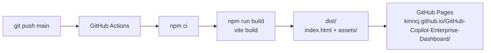
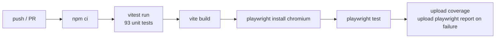

# Deployment

## GitHub Pages (production)

The site deploys automatically on every push to `main` via `.github/workflows/deploy-index-html.yml`.



### Base path

Vite reads `GITHUB_REPOSITORY` from the Actions environment and sets `base` to `/<repo-name>/` so all asset URLs are correct under the Pages subdirectory. In local dev (`GITHUB_REPOSITORY` not set), `base` defaults to `/`.

This is configured in `vite.config.js`:

```javascript
const base = process.env.GITHUB_REPOSITORY
  ? `/${process.env.GITHUB_REPOSITORY.split('/')[1]}/`
  : '/';
```

---

## Local development

```bash
make dev        # http://localhost:3000 with HMR
```

---

## Local production build

```bash
make build      # outputs to dist/
make preview    # serves dist/ locally at http://localhost:4173
```

---

## Static hosting (not GitHub Pages)

The build output in `dist/` is a standard static site. Drop it on any CDN or static host (Netlify, Cloudflare Pages, S3, etc.). The only thing to check is the base path — if the app lives at the root of a domain (`https://dashboard.example.com/`) use `base: '/'` in `vite.config.js`.

---

## CI pipeline

The `infra/ci.yml` workflow runs on push to `main` and `refactor`:



Unit tests must pass before the build runs. E2E tests run against the compiled output.

---

## Environment variables

No runtime environment variables are required — all processing is client-side. The only build-time variable used is `GITHUB_REPOSITORY` (automatically set by GitHub Actions).
