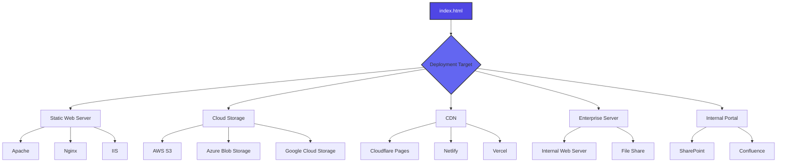
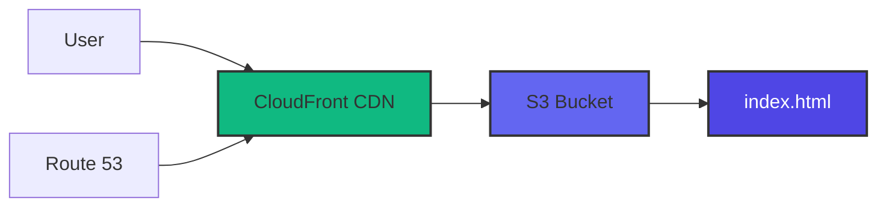
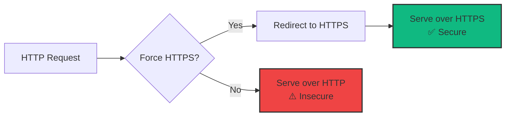
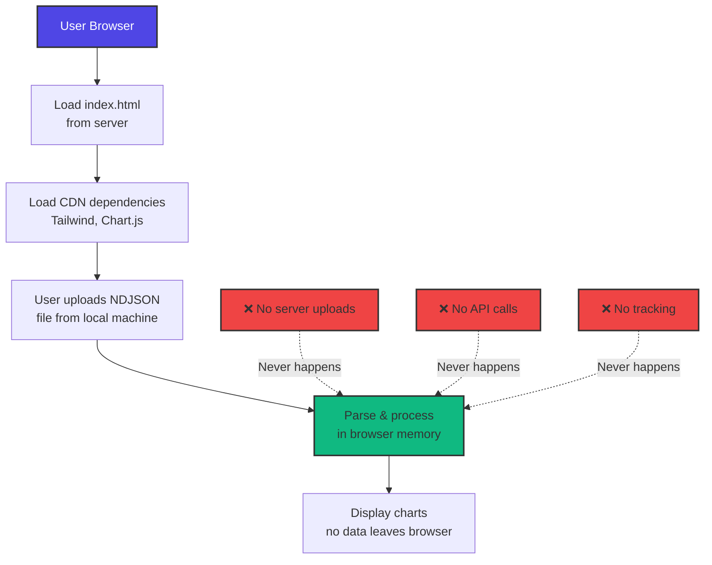
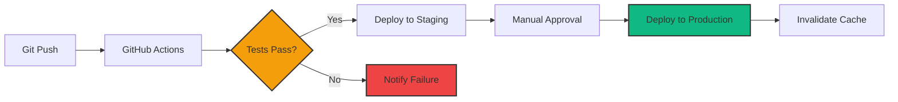

# Deployment Guide

## GitHub Pages Deployment (2026)

This project is deployed using **GitHub Pages**.

**To deploy via GitHub Pages:**
1. Push your changes to the `main` branch.
2. In your repository settings on GitHub, go to the "Pages" section.
3. Set the source branch to `main` and the folder to `/docs` (recommended) or `/` as appropriate.
4. Save the settings. Your site will be published at the provided GitHub Pages URL.

**License**

This project is licensed under the **GNU Affero General Public License v3.0 (AGPLv3)**.

Copyright © 2026 Kinn Coelho Juliao <kinncj@protonmail.com>

Complete guide for deploying the GitHub Copilot Enterprise Dashboard to various hosting platforms.

## Table of Contents

- [Deployment Overview](#deployment-overview)
- [Static File Hosting](#static-file-hosting)
- [Cloud Platforms](#cloud-platforms)
- [Enterprise Environments](#enterprise-environments)
- [Security Considerations](#security-considerations)
- [Performance Optimization](#performance-optimization)

## Deployment Overview

The dashboard is a **single HTML file** that can be deployed anywhere static files are served. No backend, database, or build process required.



### Prerequisites

- Single file: `index.html`
- Internet connection for CDN dependencies (or see offline deployment)
- Modern web browser for users

### Deployment Checklist

- [ ] Review and customize CONFIG object
- [ ] Test with production data
- [ ] Configure CORS (if needed)
- [ ] Set cache headers
- [ ] Enable HTTPS
- [ ] Document access URL for users
- [ ] Set up monitoring (optional)

## Static File Hosting

### Apache

**1. Upload file:**
```bash
scp index.html user@server:/var/www/html/copilot-dashboard/
```

**2. Configure virtual host (optional):**
```apache
<VirtualHost *:80>
    ServerName copilot-dashboard.company.com
    DocumentRoot /var/www/html/copilot-dashboard

    <Directory /var/www/html/copilot-dashboard>
        Options Indexes FollowSymLinks
        AllowOverride None
        Require all granted

        # Enable CORS for local file uploads
        Header set Access-Control-Allow-Origin "*"
    </Directory>

    # Cache static assets
    <FilesMatch "\.(html|css|js)$">
        Header set Cache-Control "max-age=3600"
    </FilesMatch>
</VirtualHost>
```

**3. Restart Apache:**
```bash
sudo systemctl restart apache2
```

### Nginx

**1. Upload file:**
```bash
scp index.html user@server:/usr/share/nginx/html/copilot-dashboard/
```

**2. Configure server block:**
```nginx
server {
    listen 80;
    server_name copilot-dashboard.company.com;
    root /usr/share/nginx/html/copilot-dashboard;

    location / {
        try_files $uri $uri/ /index.html;

        # Enable CORS
        add_header Access-Control-Allow-Origin *;

        # Cache control
        add_header Cache-Control "public, max-age=3600";
    }

    # Security headers
    add_header X-Frame-Options "SAMEORIGIN";
    add_header X-Content-Type-Options "nosniff";
    add_header X-XSS-Protection "1; mode=block";
}
```

**3. Test and reload:**
```bash
sudo nginx -t
sudo systemctl reload nginx
```

### IIS (Windows)

**1. Copy file to web directory:**
```powershell
Copy-Item index.html "C:\inetpub\wwwroot\copilot-dashboard\"
```

**2. Create web.config:**
```xml
<?xml version="1.0" encoding="UTF-8"?>
<configuration>
    <system.webServer>
        <staticContent>
            <mimeMap fileExtension=".json" mimeType="application/json" />
        </staticContent>

        <httpProtocol>
            <customHeaders>
                <add name="Access-Control-Allow-Origin" value="*" />
                <add name="Cache-Control" value="public, max-age=3600" />
            </customHeaders>
        </httpProtocol>

        <security>
            <requestFiltering>
                <requestLimits maxAllowedContentLength="104857600" />
            </requestFiltering>
        </security>
    </system.webServer>
</configuration>
```

**3. Configure application pool:**
- IIS Manager → Application Pools → Select pool
- Set .NET CLR Version to "No Managed Code"

## Cloud Platforms

### AWS S3 + CloudFront



**1. Create S3 bucket:**
```bash
aws s3 mb s3://copilot-dashboard-company
```

**2. Upload file:**
```bash
aws s3 cp index.html s3://copilot-dashboard-company/ \
    --content-type "text/html" \
    --cache-control "max-age=3600"
```

**3. Configure bucket policy:**
```json
{
    "Version": "2012-10-17",
    "Statement": [
        {
            "Sid": "PublicReadGetObject",
            "Effect": "Allow",
            "Principal": "*",
            "Action": "s3:GetObject",
            "Resource": "arn:aws:s3:::copilot-dashboard-company/*"
        }
    ]
}
```

**4. Enable static website hosting:**
```bash
aws s3 website s3://copilot-dashboard-company/ \
    --index-document index.html \
    --error-document index.html
```

**5. Create CloudFront distribution (optional, for HTTPS):**
```bash
aws cloudfront create-distribution \
    --origin-domain-name copilot-dashboard-company.s3-website-us-east-1.amazonaws.com \
    --default-root-object index.html
```

**Cost estimate:**
- S3 storage: ~$0.023/GB/month
- S3 requests: ~$0.0004/1000 requests
- CloudFront: ~$0.085/GB transferred (first 10TB)

### Azure Blob Storage + CDN

**1. Create storage account:**
```bash
az storage account create \
    --name copilotdashboard \
    --resource-group myResourceGroup \
    --location eastus \
    --sku Standard_LRS
```

**2. Enable static website:**
```bash
az storage blob service-properties update \
    --account-name copilotdashboard \
    --static-website \
    --index-document index.html
```

**3. Upload file:**
```bash
az storage blob upload \
    --account-name copilotdashboard \
    --container-name '$web' \
    --name index.html \
    --file index.html \
    --content-type "text/html"
```

**4. Get endpoint:**
```bash
az storage account show \
    --name copilotdashboard \
    --query "primaryEndpoints.web" \
    --output tsv
```

### Google Cloud Storage

**1. Create bucket:**
```bash
gsutil mb gs://copilot-dashboard-company
```

**2. Upload file:**
```bash
gsutil cp index.html gs://copilot-dashboard-company/
```

**3. Make public:**
```bash
gsutil iam ch allUsers:objectViewer gs://copilot-dashboard-company
```

**4. Configure as website:**
```bash
gsutil web set -m index.html -e index.html gs://copilot-dashboard-company
```

**Access URL:**
```
https://storage.googleapis.com/copilot-dashboard-company/index.html
```

### Netlify

**1. Via drag-and-drop:**
- Go to [app.netlify.com](https://app.netlify.com)
- Drag `index.html` to upload zone
- Get instant URL: `https://random-name.netlify.app`

**2. Via CLI:**
```bash
npm install -g netlify-cli
netlify deploy --prod --dir=. --name=copilot-dashboard
```

**3. Custom domain (optional):**
```bash
netlify domains:add copilot-dashboard.company.com
```

**Features:**
- Free tier available
- Automatic HTTPS
- Global CDN
- Instant deployments

### Cloudflare Pages

**1. Via dashboard:**
- Go to [dash.cloudflare.com](https://dash.cloudflare.com)
- Pages → Create a project → Upload files
- Drag `index.html`

**2. Via Wrangler CLI:**
```bash
npx wrangler pages publish . --project-name=copilot-dashboard
```

**Features:**
- Free tier (unlimited bandwidth)
- Automatic HTTPS
- Cloudflare CDN
- DDoS protection

### Vercel

**1. Via CLI:**
```bash
npm install -g vercel
vercel --prod
```

**2. Via drag-and-drop:**
- Go to [vercel.com](https://vercel.com)
- New Project → Upload files
- Drag `index.html`

## Enterprise Environments

### SharePoint Online

**1. Upload to SharePoint library:**
- Navigate to SharePoint site
- Documents → Upload → Files
- Upload `index.html`

**2. Get sharing link:**
- Right-click file → Share → Copy link
- Share with organization

**3. Embed in SharePoint page (optional):**
```html
<iframe src="/sites/team/Documents/index.html"
        width="100%"
        height="800px"
        frameborder="0">
</iframe>
```

**Considerations:**
- May require SharePoint permissions
- Users need organization access
- File upload size limits apply

### Confluence

**1. Create new page:**
- Space → Create → Blank page

**2. Attach file:**
- Edit page → Attachments → Upload `index.html`

**3. Embed using HTML macro:**
```html
<iframe src="/download/attachments/page-id/index.html"
        width="100%"
        height="800px">
</iframe>
```

### Internal Web Server

**Docker deployment:**

**1. Create Dockerfile:**
```dockerfile
FROM nginx:alpine

COPY index.html /usr/share/nginx/html/

EXPOSE 80

CMD ["nginx", "-g", "daemon off;"]
```

**2. Build and run:**
```bash
docker build -t copilot-dashboard .
docker run -d -p 80:80 copilot-dashboard
```

**Docker Compose:**
```yaml
version: '3'
services:
  dashboard:
    image: nginx:alpine
    volumes:
      - ./index.html:/usr/share/nginx/html/index.html:ro
    ports:
      - "80:80"
    restart: unless-stopped
```

## Security Considerations

### HTTPS Configuration

**Always use HTTPS in production:**



**Nginx HTTPS redirect:**
```nginx
server {
    listen 80;
    server_name copilot-dashboard.company.com;
    return 301 https://$server_name$request_uri;
}

server {
    listen 443 ssl http2;
    server_name copilot-dashboard.company.com;

    ssl_certificate /etc/ssl/certs/dashboard.crt;
    ssl_certificate_key /etc/ssl/private/dashboard.key;

    # ... rest of config ...
}
```

### Content Security Policy

**Add CSP header for enhanced security:**

```nginx
add_header Content-Security-Policy
    "default-src 'self';
     script-src 'self' 'unsafe-inline'
         https://cdn.tailwindcss.com
         https://cdn.jsdelivr.net
         https://unpkg.com;
     style-src 'self' 'unsafe-inline'
         https://cdn.tailwindcss.com;"
    always;
```

**Why unsafe-inline is needed:**
- Embedded CSS and JavaScript in single-file architecture
- Consider extracting to separate files for stricter CSP

### Access Control

**1. IP whitelisting (Nginx):**
```nginx
location / {
    allow 10.0.0.0/8;        # Internal network
    allow 192.168.1.0/24;    # Office network
    deny all;
}
```

**2. Basic authentication:**
```nginx
location / {
    auth_basic "Copilot Dashboard";
    auth_basic_user_file /etc/nginx/.htpasswd;
}
```

Create password file:
```bash
htpasswd -c /etc/nginx/.htpasswd admin
```

**3. SSO integration (advanced):**
- Use reverse proxy with OAuth2 (e.g., oauth2-proxy)
- Integrate with corporate identity provider

### Data Privacy

**Key principle: All data processing is client-side**



**Best practices:**
- Communicate to users: "All data stays in your browser"
- No server-side logging of uploaded data
- No analytics tracking of usage patterns (unless explicitly added)
- Users can use offline after initial load

## Performance Optimization

### Cache Headers

**Aggressive caching (Nginx):**
```nginx
location / {
    # Cache HTML for 1 hour
    location ~* \.html$ {
        add_header Cache-Control "public, max-age=3600";
    }

    # Cache CDN resources loaded by browser
    # (Note: CDNs manage their own caching)
}
```

**CloudFront caching:**
```bash
aws cloudfront create-invalidation \
    --distribution-id DISTRIBUTION_ID \
    --paths "/index.html"
```

### Compression

**Enable gzip (Nginx):**
```nginx
gzip on;
gzip_types text/html text/css application/javascript;
gzip_min_length 1000;
gzip_comp_level 6;
```

**Enable Brotli (Nginx with module):**
```nginx
brotli on;
brotli_types text/html text/css application/javascript;
```

### CDN Strategy

**Consideration for CDN dependencies:**

The dashboard loads:
- Tailwind CSS (~70KB)
- Chart.js (~200KB)
- Lucide Icons (~50KB)

**Options:**

1. **Keep CDN links (recommended for simplicity)**
   - Fast global delivery
   - Browser caching across sites
   - Automatic updates

2. **Self-host dependencies (for offline/air-gapped)**
   - Download libraries
   - Bundle with index.html or serve separately
   - Full offline capability

**Self-hosting example:**
```html
<!-- Instead of CDN -->
<script src="https://cdn.tailwindcss.com"></script>

<!-- Use local -->
<script src="./assets/tailwind.js"></script>
```

### Monitoring

**Health check endpoint (if using web server):**

Create `health.html`:
```html
<!DOCTYPE html>
<html>
<head><title>Health Check</title></head>
<body>OK</body>
</html>
```

**Uptime monitoring:**
- Use services like Pingdom, UptimeRobot, or StatusCake
- Monitor main dashboard URL
- Alert on downtime

**Usage analytics (optional):**

Add to `index.html` (only if needed):
```html
<script>
// Simple page view tracking
fetch('https://analytics.company.com/track', {
    method: 'POST',
    body: JSON.stringify({
        page: 'copilot-dashboard',
        timestamp: new Date().toISOString()
    })
});
</script>
```

## Deployment Automation

### GitHub Actions

**`.github/workflows/deploy.yml`:**
```yaml
name: Deploy to S3

on:
  push:
    branches: [ main ]

jobs:
  deploy:
    runs-on: ubuntu-latest
    steps:
      - uses: actions/checkout@v2

      - name: Configure AWS credentials
        uses: aws-actions/configure-aws-credentials@v1
        with:
          aws-access-key-id: ${{ secrets.AWS_ACCESS_KEY_ID }}
          aws-secret-access-key: ${{ secrets.AWS_SECRET_ACCESS_KEY }}
          aws-region: us-east-1

      - name: Deploy to S3
        run: |
          aws s3 cp index.html s3://copilot-dashboard-company/ \
            --content-type "text/html" \
            --cache-control "max-age=3600"

      - name: Invalidate CloudFront
        run: |
          aws cloudfront create-invalidation \
            --distribution-id ${{ secrets.CLOUDFRONT_DIST_ID }} \
            --paths "/index.html"
```

### Continuous Deployment



## Next Steps

- **[Configuration](./configuration.md)** - Customize before deployment
- **[Troubleshooting](./troubleshooting.md)** - Fix deployment issues
- **[Security Best Practices](https://owasp.org/www-project-web-security-testing-guide/)** - OWASP guidelines
