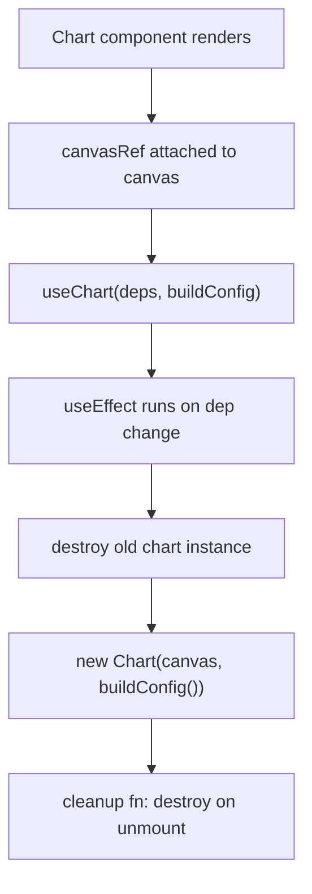

# Development Guide

## Running locally

```bash
make install   # npm install + playwright browsers
make dev       # vite dev server at http://localhost:3000
make test      # unit tests (vitest)
make test-e2e  # playwright e2e
make test-all  # both
```

Or without Make:

```bash
npm install
npm run dev
npm run test
npm run test:e2e
```

---

## Project structure

```
app/
  domain/          # Pure JS — no DOM, fully testable in Node
    config/        # Constants and feature labels (FEATURE_LABELS, CONFIG)
    data/          # Parser, merger, aggregator
    filtering/     # Filter engine + dropdown option extraction
    insights/      # Insight card generation
    export/        # CSV and NDJSON builders
  state/
    useAppState.js # Central React hook — orchestrates all domain calls
  presentation/
    context/       # AppContext + useApp hook
    components/    # React JSX components
      upload/      # UploadZone
      progress/    # ProgressBar
      dashboard/   # Dashboard, Header, FilterBar
      kpi/         # KpiSection, KpiCard, FeatureAdoptionCard
      insights/    # InsightsPanel, InsightCard
      table/       # DataTable
      export/      # ExportMenu
      glossary/    # MetricsGlossary
      config/      # ValueConfig
      shared/      # SectionDivider, Footer
    charts/        # Chart.js components (one file per chart)
      hooks/       # useChart.js lifecycle hook
    styles/        # global.css (Tailwind + design tokens)
  main.jsx         # React entry point

common/
  utils/           # formatNumber, humanizeFeature, triggerDownload
  types/           # JSDoc type definitions

tests/
  unit/            # Mirrors app/domain/ structure
  e2e/             # Playwright tests against the running app
```

**The rule: domain/ has no DOM access.** If a function needs `document` or `window`, it belongs in `presentation/`.

---

## Adding a new insight

Insights live in `app/domain/insights/engine.js`. Add a block to `generateInsights()` before the `return`:

```javascript
// in generateInsights()
const myInsight = filteredRecords.filter(r => /* your condition */);
if (myInsight.length > 0) {
  insights.push({
    title: 'My Insight',
    subtitle: 'What this means',
    type: 'warning',   // success | warning | error | info
    icon: 'alert-circle',
    content: `${myInsight.length} records match`
  });
}
```

If you use an icon key that isn't already in `InsightCard.jsx`, register it there:

```javascript
// app/presentation/components/insights/InsightCard.jsx
import { ..., MyIcon } from 'lucide-react';
const icons = {
  // ... existing entries ...
  'my-icon': MyIcon,
};
```

Current registered icons: `star`, `trending-up`, `trending-down`, `alert-circle`, `x-circle`, `award`.

Then add a test in `tests/unit/domain/insights/engine.test.js`:

```javascript
it('flags my condition', () => {
  const records = [{ user_login: 'alice', day: '2025-01-01', /* ... */ }];
  const insights = generateInsights(makeAggregated(), records, defaultConfig);
  const mine = insights.find(i => i.title === 'My Insight');
  expect(mine).toBeDefined();
});
```

No other presentation code changes needed — `InsightsPanel` renders whatever `generateInsights` returns.

---

## Adding a new chart

1. Create `app/presentation/charts/MyChart.jsx`:

```jsx
import React from 'react';
import { useChart } from './hooks/useChart.js';
import { ChartCard } from './ChartCard.jsx';
import { getChartDefaults } from './chartOptions.js';

export function MyChart({ aggregatedData }) {
  const { byDay = {} } = aggregatedData;

  const { canvasRef, chartRef } = useChart([JSON.stringify(byDay)], () => {
    const labels = Object.keys(byDay).sort();
    const defaults = getChartDefaults();
    return {
      type: 'bar',
      data: {
        labels,
        datasets: [{
          label: 'My Metric',
          data: labels.map(d => byDay[d].someField),
          backgroundColor: '#818cf8'
        }]
      },
      options: defaults
    };
  });

  return (
    <ChartCard title="My Chart" subtitle="What it shows" chartRef={chartRef}>
      <canvas ref={canvasRef} />
    </ChartCard>
  );
}
```

2. Import and render it in `app/presentation/components/dashboard/Dashboard.jsx`:

```jsx
import { MyChart } from '../../charts/MyChart.jsx';
// inside Dashboard's JSX:
<MyChart aggregatedData={aggregatedData} />
```

3. Add a CSV export function to `app/domain/export/csv.js` and pass `onCSV` to `ChartCard`.

The `useChart(deps, buildConfig)` hook handles Chart.js lifecycle — it destroys and recreates the chart whenever `deps` changes.

---

## Adding a new KPI card

KPI cards live in `app/presentation/components/kpi/KpiSection.jsx`. Each `<KpiCard>` takes:

```jsx
<KpiCard
  label="My Metric"
  value={formatNumber(myValue)}
  icon="activity"
  subtitle="optional context"
  tooltip="Shown on hover"
/>
```

Add it to the relevant section in `KpiSection` (Activity, Lines of Code, or Feature Adoption).

---

## Adding a new filter

1. Add the filter field to the `filters` state in `app/state/useAppState.js`.
2. Add extraction to `extractFilterOptions()` in `app/domain/filtering/engine.js`.
3. Add the condition to `filterRecords()`:

```javascript
if (criteria.myFilter) {
  if (!record.some_field.includes(criteria.myFilter)) return false;
}
```

4. Add a Mantine `<Select>` to `app/presentation/components/dashboard/FilterBar.jsx` wired to `setFilters`. Provide `searchable` and `clearable` props. Build a `data` array as `[{ value: '', label: 'All X' }, ...options]`.
5. Add tests in `tests/unit/domain/filtering/engine.test.js`.

---

## UI component library (Mantine)

Interactive filter controls use [Mantine v8](https://mantine.dev). The provider is in `app/main.jsx`:

- `MantineProvider` wraps the whole app with `defaultColorScheme="dark"` and a custom green primary color
- `@mantine/core/styles.css` and `@mantine/dates/styles.css` are imported in `main.jsx`
- Design tokens are mapped to Mantine CSS variables in `global.css` under `[data-mantine-color-scheme="dark"]`

### Components in use

| Component | Used for | Key props |
|-----------|----------|-----------|
| `DatePickerInput type="range"` | Date range filter | `value={[from, to]}`, `onChange([from, to])`, `numberOfColumns={1}`, `popoverProps={{ withinPortal: true, width: 300 }}` |
| `Select` | User / IDE / Language filters | `data={options}`, `searchable`, `clearable`, `comboboxProps={{ withinPortal: true }}` |

### Dark / light mode

The app ships with dark mode as default (`defaultColorScheme="dark"` in `MantineProvider`). A toggle button in the header and upload screen switches between modes using `useMantineColorScheme()`. The user's preference persists in localStorage automatically via Mantine's color scheme manager.

Color scheme-aware chart colors are handled by `getChartColors()` in `app/presentation/charts/chartOptions.js`, which reads `data-mantine-color-scheme` from the document root. Charts rebuild on scheme change via a `MutationObserver` in `useChart.js`.

### CSS override approach

Mantine v8 uses CSS modules with hashed class names. Override styles via:
1. CSS variable overrides in `global.css` under `[data-mantine-color-scheme="dark"]` and `[data-mantine-color-scheme="light"]` blocks — for colors, backgrounds, borders
2. Class-based overrides targeting stable semantic class names like `.mantine-Input-input`, `.mantine-DatePickerInput-day`, `.mantine-Combobox-option`

Do not pass pseudo-selector styles (e.g. `'&:focus': {...}`) in component `styles` props — React will log warnings. Use global CSS instead.

### Adding a new Mantine component

1. Import from `@mantine/core` or `@mantine/dates`
2. Wire value/onChange to `filters` state via `setFilters`
3. Add CSS overrides for the component's semantic classes to `global.css`
4. Update the e2e tests — Mantine components render accessible roles (`textbox`, `button`, `option`), not native `<select>` / `<input type="date">`

---

## Adding a new export

Pure builders go in `app/domain/export/csv.js`. They receive data slices as arguments and return strings — no Blob, no `document`:

```javascript
export function buildMyExportCSV(aggregated) {
  const rows = Object.entries(aggregated.byUser).map(([user, d]) => [user, d.generations]);
  return buildCSV(['User', 'Generations'], rows);
}
```

The presentation layer calls `triggerDownload(new Blob([csv], { type: 'text/csv' }), 'my-export.csv')` from `common/utils/download.js`.

---

## Chart lifecycle pattern



`buildConfig` is a factory function called inside `useEffect`. It closes over the component's current props/state. `deps` array controls when the chart rebuilds — typically `[JSON.stringify(dataSlice)]`.
