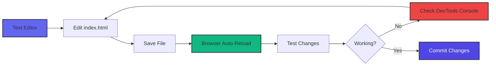
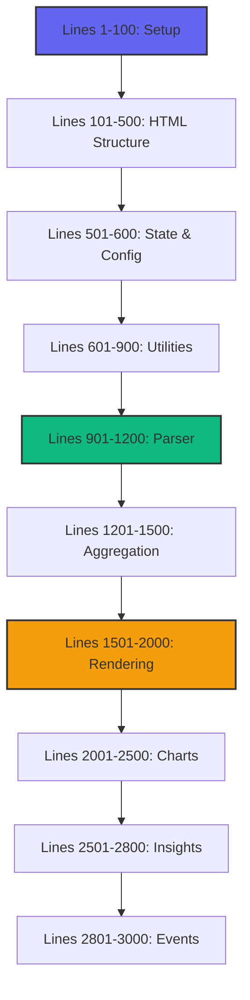
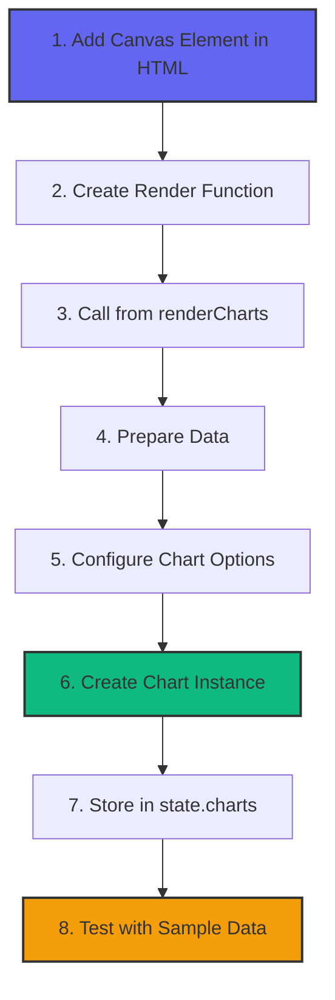
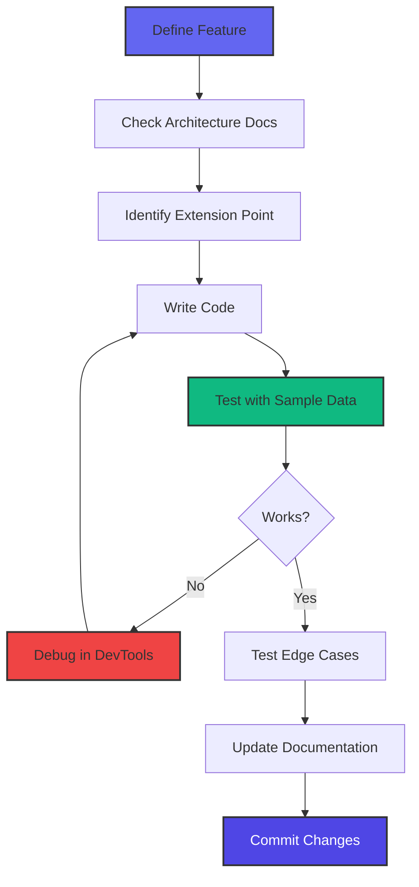

# Development Guide

Complete guide for extending and customizing the GitHub Copilot Enterprise Dashboard.

## Table of Contents

- [Development Setup](#development-setup)
- [Code Structure](#code-structure)
- [Adding New Features](#adding-new-features)
- [Development Workflow](#development-workflow)
- [Testing](#testing)
- [Best Practices](#best-practices)

## Development Setup

### Prerequisites

- Text editor or IDE (VS Code, Sublime, Atom, etc.)
- Modern web browser with DevTools
- Optional: Local web server for development

### Setup Steps

1. **Clone the repository:**
   ```bash
   git clone https://github.com/kinncj/GitHub-Copilot-Enterprise-Dashboard.git
   cd GitHub-Copilot-Enterprise-Dashboard
   ```

2. **Start development server (optional):**
   ```bash
   # Python
   python3 -m http.server 8000

   # Or use VS Code Live Server extension
   # Or simply open index.html in browser
   ```

3. **Open browser DevTools:**
   - Chrome/Edge: F12 or Cmd+Option+I (Mac)
   - Firefox: F12 or Cmd+Option+K (Mac)
   - Safari: Cmd+Option+I (enable Develop menu first)

### Development Environment



## Code Structure

### File Organization

The dashboard is a single `index.html` file organized into logical sections:

```
index.html
├── HEAD Section
│   ├── CDN Dependencies (Tailwind, Chart.js, Lucide)
│   ├── Custom CSS Styles
│   └── Configuration
├── BODY Section
│   ├── Header & Navigation
│   ├── Upload Section
│   ├── Filter Controls
│   ├── KPI Cards Container
│   ├── Charts Grid
│   ├── Insights Panel
│   └── Data Table
└── SCRIPT Section
    ├── Global State
    ├── CONFIG Object
    ├── Utility Functions
    ├── Parser Module
    ├── Aggregation Module
    ├── Filter Module
    ├── Rendering Module
    ├── Chart Renderers
    ├── Insights Engine
    └── Event Handlers
```

### Code Map (Line References)



## Adding New Features

### Adding a New KPI Card

**1. Calculate the metric in `renderKPIs()` function:**

```javascript
function renderKPIs() {
    const kpis = [
        // Existing KPIs...

        // NEW KPI: Average Active Hours per User
        {
            title: 'Avg Active Hours/User',
            value: formatNumber(
                (state.aggregatedData.totals.totalActiveTime / 60) /
                state.aggregatedData.totals.uniqueUsers
            ),
            subtitle: 'Average active coding hours per user',
            icon: 'clock',
            trend: '+12%',  // Optional
            trendUp: true   // Optional
        }
    ];

    // Rendering logic...
}
```

**2. Icon reference:**
- Browse available icons at [lucide.dev/icons](https://lucide.dev/icons)
- Use the icon name without `lucide-` prefix

### Adding a New Chart

**Step-by-step process:**



**1. Add canvas element (HTML section, around line 450):**

```html
<div class="card">
    <h3 class="text-xl font-semibold mb-4">
        <i data-lucide="trending-up" class="inline w-5 h-5 mr-2"></i>
        My New Chart
    </h3>
    <div class="chart-container">
        <canvas id="myNewChart"></canvas>
    </div>
</div>
```

**2. Create render function (after existing chart functions):**

```javascript
function renderMyNewChart() {
    const ctx = document.getElementById('myNewChart');
    if (!ctx) return;

    // Destroy existing chart if it exists
    if (state.charts.myNewChart) {
        state.charts.myNewChart.destroy();
    }

    // Prepare data from aggregated state
    const data = {
        labels: Object.keys(state.aggregatedData.byLanguage),
        datasets: [{
            label: 'My Metric',
            data: Object.values(state.aggregatedData.byLanguage)
                .map(lang => lang.totalGenerations),
            backgroundColor: '#6366f1',
            borderColor: '#4f46e5',
            borderWidth: 2
        }]
    };

    // Create chart with shared options
    state.charts.myNewChart = new Chart(ctx, {
        type: 'bar',  // or 'line', 'pie', 'doughnut', 'scatter'
        data: data,
        options: getChartOptions('bar', {
            // Custom options here
            scales: {
                y: {
                    beginAtZero: true
                }
            }
        })
    });
}
```

**3. Call from `renderCharts()` function:**

```javascript
function renderCharts() {
    if (!state.filteredData.length) return;

    renderActivityChart();
    renderAcceptanceRateChart();
    // ... existing charts ...
    renderMyNewChart();  // Add this line
}
```

### Adding a New Filter

**1. Add filter dropdown (HTML section):**

```html
<div>
    <label class="block text-sm font-medium text-slate-400 mb-2">
        <i data-lucide="filter" class="inline w-4 h-4 mr-1"></i>
        My Filter
    </label>
    <select id="myFilter" class="w-full px-4 py-2 rounded-lg bg-slate-700 border border-slate-600">
        <option value="">All Options</option>
        <!-- Options populated dynamically -->
    </select>
</div>
```

**2. Add filter state (in global state object):**

```javascript
const state = {
    // ... existing state ...
    filters: {
        // ... existing filters ...
        myFilter: null  // Add new filter
    }
};
```

**3. Update filter logic in `applyFilters()` function:**

```javascript
function applyFilters() {
    let filtered = [...state.rawData];

    // Existing filters...

    // NEW FILTER
    if (state.filters.myFilter) {
        filtered = filtered.filter(record =>
            record.someField === state.filters.myFilter
        );
    }

    state.filteredData = filtered;
    aggregateData();
    renderDashboard();
}
```

**4. Add event listener (in initialization):**

```javascript
document.getElementById('myFilter').addEventListener('change', (e) => {
    state.filters.myFilter = e.target.value || null;
    applyFilters();
});
```

### Adding a New Insight

**Add insight logic to `generateInsights()` function:**

```javascript
function generateInsights() {
    const insights = [];

    // Existing insights...

    // NEW INSIGHT: Detect Language Diversity
    const languageCount = Object.keys(state.aggregatedData.byLanguage).length;
    if (languageCount >= 10) {
        insights.push({
            type: 'info',  // 'success', 'warning', 'error', 'info'
            icon: 'globe',
            title: 'High Language Diversity',
            description: `Team is working with ${languageCount} different programming languages.`,
            value: `${languageCount} languages`
        });
    }

    return insights;
}
```

**Insight types and styling:**

| Type | Icon Color | Badge Color | Use Case |
|------|-----------|-------------|----------|
| `success` | Green | `badge-success` | Positive achievements |
| `warning` | Amber | `badge-warning` | Attention needed |
| `error` | Red | `badge-error` | Critical issues |
| `info` | Blue | `badge-info` | Informational |

### Adding a New Aggregation Dimension

**1. Add to `aggregateData()` function:**

```javascript
function aggregateData() {
    const agg = {
        byUser: {},
        byDay: {},
        // ... existing aggregations ...
        byCustomDimension: {},  // NEW
        totals: {}
    };

    state.filteredData.forEach(record => {
        // Existing aggregation logic...

        // NEW AGGREGATION
        const customKey = record.someField;
        if (!agg.byCustomDimension[customKey]) {
            agg.byCustomDimension[customKey] = {
                key: customKey,
                totalGenerations: 0,
                totalAcceptances: 0
            };
        }
        agg.byCustomDimension[customKey].totalGenerations += record.generations;
        agg.byCustomDimension[customKey].totalAcceptances += record.acceptances;
    });

    // Calculate derived metrics
    Object.values(agg.byCustomDimension).forEach(item => {
        item.acceptanceRate = item.totalAcceptances / item.totalGenerations;
    });

    state.aggregatedData = agg;
}
```

**2. Use in charts or insights:**

```javascript
const customData = Object.values(state.aggregatedData.byCustomDimension);
// Use customData in your chart or insight
```

## Development Workflow

### Feature Development Process



### Debugging Tips

**1. Use browser DevTools Console:**

```javascript
// Add debug logging
console.log('Current state:', state);
console.log('Filtered data:', state.filteredData);
console.log('Aggregated data:', state.aggregatedData);

// Inspect specific record
console.table(state.rawData.slice(0, 10));

// Performance timing
console.time('parseNDJSON');
parseNDJSON(file);
console.timeEnd('parseNDJSON');
```

**2. Breakpoints:**
- Open DevTools → Sources tab
- Navigate to index.html
- Click line numbers to set breakpoints
- Reload page to hit breakpoints

**3. Network monitoring:**
- DevTools → Network tab
- Check CDN dependency loading
- Verify no unexpected network requests

### Version Control

**Git workflow:**

```bash
# Create feature branch
git checkout -b feature/new-chart

# Make changes
# ... edit index.html ...

# Test thoroughly
# ... verify in browser ...

# Commit with descriptive message
git add index.html docs/
git commit -m "Add new chart: Activity by Hour

- Added hourly activity breakdown chart
- Updated documentation
- Added new aggregation dimension"

# Push to remote
git push origin feature/new-chart

# Create pull request on GitHub
```

## Testing

### Manual Testing Checklist

- [ ] **File Upload**
  - [ ] Drag & drop works
  - [ ] Click to upload works
  - [ ] Invalid file shows error
  - [ ] Large file (>50MB) parses without freezing

- [ ] **Data Processing**
  - [ ] All records parsed correctly
  - [ ] Invalid records skipped with console warning
  - [ ] Aggregations calculate correctly

- [ ] **Filters**
  - [ ] Date range filters work
  - [ ] Quick range buttons work
  - [ ] User filter works
  - [ ] IDE filter works
  - [ ] Language filter works
  - [ ] Multiple filters combine correctly

- [ ] **Charts**
  - [ ] All charts render
  - [ ] Charts update on filter change
  - [ ] Tooltips show correct data
  - [ ] No console errors

- [ ] **Insights**
  - [ ] Insights generate correctly
  - [ ] Thresholds trigger appropriately
  - [ ] No duplicate insights

- [ ] **Table**
  - [ ] Data displays correctly
  - [ ] Sorting works on all columns
  - [ ] CSV export works

- [ ] **Performance**
  - [ ] UI remains responsive during parsing
  - [ ] Filter changes apply quickly (<500ms)
  - [ ] No memory leaks (check DevTools Memory)

### Test Data

Create test NDJSON files for various scenarios:

**1. Minimal test data:**
```json
{"user_login":"alice","day":"2024-01-15","code_generation_activity_count":10,"code_acceptance_activity_count":7,"loc_added_sum":50,"loc_deleted_sum":20,"active_time_minutes":30}
{"user_login":"bob","day":"2024-01-15","code_generation_activity_count":5,"code_acceptance_activity_count":4,"loc_added_sum":25,"loc_deleted_sum":10,"active_time_minutes":15}
```

**2. Edge cases:**
```json
{"user_login":"zero_acceptance","day":"2024-01-15","code_generation_activity_count":100,"code_acceptance_activity_count":0,"loc_added_sum":0,"loc_deleted_sum":0,"active_time_minutes":60}
{"user_login":"perfect_acceptance","day":"2024-01-15","code_generation_activity_count":50,"code_acceptance_activity_count":50,"loc_added_sum":500,"loc_deleted_sum":0,"active_time_minutes":120}
{"user_login":"high_volume","day":"2024-01-15","code_generation_activity_count":1000,"code_acceptance_activity_count":700,"loc_added_sum":5000,"loc_deleted_sum":1000,"active_time_minutes":480}
```

**3. Invalid data (should be skipped):**
```json
{"day":"2024-01-15","code_generation_activity_count":10}
{"user_login":"invalid_date","day":"not-a-date","code_generation_activity_count":10}
{"user_login":"negative","day":"2024-01-15","code_generation_activity_count":-5}
```

### Automated Testing (Future Enhancement)

For more robust testing, consider adding:

```javascript
// Example test structure (not currently implemented)
const tests = {
    parseNDJSON: () => {
        const sampleData = '{"user_login":"alice","day":"2024-01-15",...}';
        const result = parseNDJSON(new Blob([sampleData]));
        assert(result.length === 1);
        assert(result[0].user_login === "alice");
    },

    aggregateData: () => {
        state.filteredData = [/* sample records */];
        aggregateData();
        assert(state.aggregatedData.totals.totalGenerations > 0);
    }
};
```

## Best Practices

### Code Style

**1. Consistent naming:**
```javascript
// Functions: camelCase, descriptive verbs
function renderActivityChart() { }
function parseNDJSON() { }
function aggregateData() { }

// Variables: camelCase, descriptive nouns
const totalGenerations = 100;
const acceptanceRate = 0.75;

// Constants: UPPER_SNAKE_CASE
const MAX_USERS_SHOWN = 15;
const CHUNK_SIZE = 10000;
```

**2. Document complex logic:**
```javascript
// Calculate 7-day moving average for acceptance rate trend
// This smooths out daily fluctuations to show overall trends
const movingAvg = [];
for (let i = 0; i < data.length; i++) {
    const start = Math.max(0, i - 6);
    const window = data.slice(start, i + 1);
    const avg = window.reduce((sum, d) => sum + d.rate, 0) / window.length;
    movingAvg.push(avg);
}
```

**3. Error handling:**
```javascript
function parseRecord(line) {
    try {
        const record = JSON.parse(line);

        if (!record.user_login || !record.day) {
            console.warn('Missing required fields:', record);
            return null;
        }

        return normalizeRecord(record);
    } catch (error) {
        console.error('Parse error:', error, 'Line:', line);
        return null;
    }
}
```

### Performance Optimization

**1. Avoid unnecessary re-renders:**
```javascript
// BAD: Re-aggregate on every filter change
function applyFilter() {
    state.filteredData = filterData();
    aggregateData();  // Expensive!
    renderDashboard();
}

// GOOD: Only aggregate if data actually changed
function applyFilter() {
    const before = state.filteredData.length;
    state.filteredData = filterData();
    const after = state.filteredData.length;

    if (before !== after) {
        aggregateData();
        renderDashboard();
    }
}
```

**2. Debounce expensive operations:**
```javascript
let debounceTimer;
function onFilterChange() {
    clearTimeout(debounceTimer);
    debounceTimer = setTimeout(() => {
        applyFilters();
    }, 300);  // Wait 300ms after user stops typing
}
```

**3. Use efficient data structures:**
```javascript
// BAD: Array search O(n)
const user = state.rawData.find(r => r.user === 'alice');

// GOOD: Object lookup O(1)
const user = state.aggregatedData.byUser['alice'];
```

### Accessibility

**1. Semantic HTML:**
```html
<button aria-label="Upload file">Upload</button>
<table role="table" aria-label="User activity data">
```

**2. Keyboard navigation:**
```javascript
document.addEventListener('keydown', (e) => {
    if (e.key === 'Escape') {
        closeModal();
    }
});
```

**3. Color contrast:**
- Ensure text has sufficient contrast ratio (WCAG AA: 4.5:1)
- Don't rely solely on color to convey information

## Next Steps

- **[API Reference](./api-reference.md)** - Detailed function documentation
- **[Troubleshooting](./troubleshooting.md)** - Debug common issues
- **[Architecture](./architecture.md)** - Understand system design
