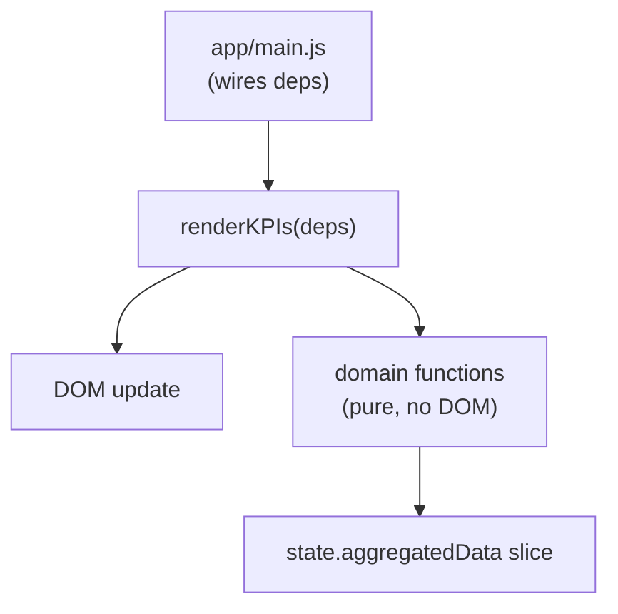

# Development Guide

## Running locally

```bash
make install   # npm install + playwright browsers
make dev       # vite dev server at http://localhost:3000
make test      # unit tests (vitest)
make test-e2e  # playwright e2e
make test-all  # both
```

Or without Make:

```bash
npm install
npm run dev
npm run test
npm run test:e2e
```

---

## Project structure

```
app/
  domain/          # Pure JS — no DOM, fully testable in Node
    config/        # Constants and feature labels
    data/          # Parser, merger, aggregator
    filtering/     # Filter engine + dropdown option extraction
    insights/      # Insight card generation
    export/        # CSV and NDJSON builders
  state/           # Central store (one object, mutated in place)
  presentation/    # DOM-aware components and chart renderers
  main.js          # Wires everything together

common/
  utils/           # formatNumber, humanizeFeature, triggerDownload
  types/           # JSDoc type definitions

tests/
  unit/            # Mirrors app/domain/ and common/ structure
  e2e/             # Playwright tests against the running app
```

The rule: **domain/ has no DOM access**. If a function needs `document`, it belongs in `presentation/`.

---

## Adding a new insight

Insights live in `app/domain/insights/engine.js`. The function `generateInsights` returns `Insight[]` — add a new block before the return:

```javascript
// in generateInsights()
const myInsight = filteredRecords.filter(r => /* your condition */);
if (myInsight.length > 0) {
  insights.push({
    title: 'My Insight',
    subtitle: 'What this means',
    type: 'warning',   // success | warning | error | info
    icon: 'alert-circle',
    content: `${myInsight.length} records match`
  });
}
```

Then add a test in `tests/unit/domain/insights/engine.test.js`:

```javascript
it('flags my condition', () => {
  const records = [{ user_login: 'alice', day: '2025-01-01', /* ... */ }];
  const insights = generateInsights(makeAggregated(), records, defaultConfig);
  const mine = insights.find(i => i.title === 'My Insight');
  expect(mine).toBeDefined();
});
```

---

## Adding a new chart

1. Create `app/presentation/charts/my-chart.js`:

```javascript
import { state } from '../../state/store.js';

export function renderMyChart() {
  const { aggregatedData, charts } = state;
  if (charts.myChart) charts.myChart.destroy();

  const ctx = document.getElementById('myChart').getContext('2d');
  charts.myChart = new Chart(ctx, {
    type: 'bar',
    data: { /* built from aggregatedData */ },
    options: getChartOptions('My Chart Title')
  });
}
```

2. Add `<canvas id="myChart">` and a card wrapper to `index.html`.

3. Import and call `renderMyChart()` from `app/presentation/charts/index.js`.

4. Add a CSV export function to `app/domain/export/csv.js` and a button to the card header.

---

## Adding a new KPI card

KPI cards are rendered by `app/presentation/components/kpi.js`. Each card is an object:

```javascript
{
  label: 'My Metric',
  value: formatNumber(myValue),
  icon: 'activity',
  color: 'blue',
  subtitle: 'optional context line',
  tooltip: 'Explanation shown on hover'
}
```

Add it to the relevant section array in `renderKPIs()`.

---

## Adding a new filter

1. Add a `<select id="myFilter">` in `index.html`.
2. Add `myFilter` extraction to `extractFilterOptions()` in `app/domain/filtering/engine.js`.
3. Add the filter condition to `filterRecords()`:

```javascript
if (criteria.myFilter) {
  if (!record.some_field.includes(criteria.myFilter)) return false;
}
```

4. Wire the DOM select → state → `applyFilters()` in `app/main.js`.
5. Add tests in `tests/unit/domain/filtering/engine.test.js`.

---

## Adding a new export

Pure builders go in `app/domain/export/csv.js` (or a new file in `export/`). They receive data slices as arguments and return strings. No Blob, no `document` — that's the caller's job.

```javascript
// app/domain/export/csv.js
export function buildMyExportCSV(aggregated) {
  const rows = Object.entries(aggregated.byUser).map(([user, d]) => [user, d.generations]);
  return buildCSV(['User', 'Generations'], rows);
}
```

The presentation layer calls `triggerDownload(new Blob([csv], { type: 'text/csv' }), 'my-export.csv')` from `common/utils/download.js`.

---

## Composition pattern for presentation components

Presentation components follow a HOC-style composition: a component function takes a render dependency object rather than reading globals directly. This lets you test render logic by passing mock data.



The `deps` object carries everything a component needs: `aggregatedData`, `filteredData`, `config`, `onExport`, etc. Nothing is read from global state inside the component — it's all passed in.
