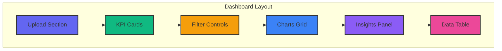
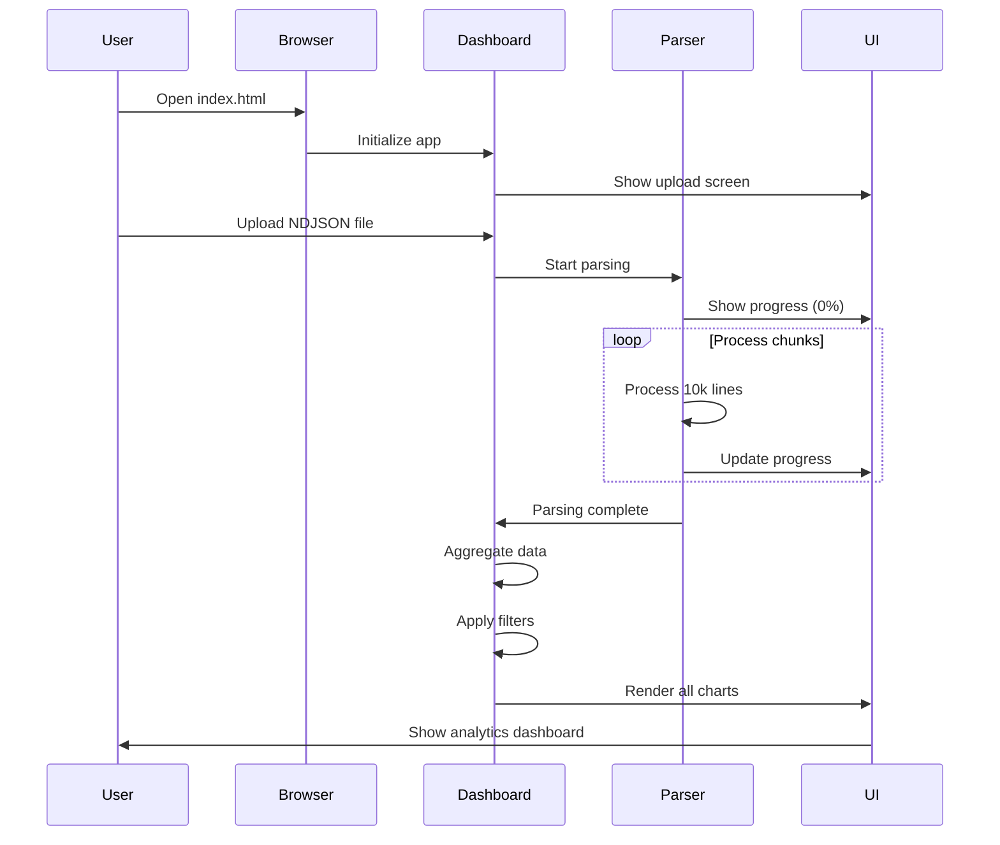
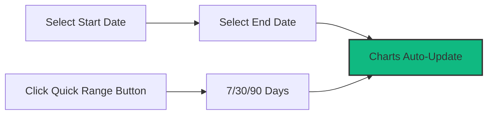

# Getting Started

This guide will help you get up and running with the GitHub Copilot Enterprise Dashboard in minutes.

## Table of Contents

- [Prerequisites](#prerequisites)
- [Quick Start](#quick-start)
- [First-Time Setup](#first-time-setup)
- [Loading Data](#loading-data)
- [Basic Usage](#basic-usage)
- [Next Steps](#next-steps)

## Prerequisites

### Browser Requirements

The dashboard requires a modern web browser with ES6+ JavaScript support:

| Browser | Minimum Version | Recommended |
|---------|----------------|-------------|
| **Chrome** | 90+ | Latest |
| **Firefox** | 88+ | Latest |
| **Safari** | 14+ | Latest |
| **Edge** | 90+ | Latest |

### Data Requirements

You'll need GitHub Copilot Enterprise usage data exported as NDJSON (Newline Delimited JSON) files:

- **Format:** `.ndjson` or `.json` files with one JSON object per line
- **Source:** GitHub Enterprise Server Copilot Analytics exports
- **Size:** Any size supported (optimized for files up to 100MB)

### Optional: Local Web Server

While not required, a local web server can help avoid CORS issues:

```bash
# Python 3
python3 -m http.server 8000

# Node.js (if you have it installed)
npx serve .

# PHP
php -S localhost:8000
```

## Quick Start

### 1. Download the Dashboard

Clone or download the repository:

```bash
git clone https://github.com/kinncj/GitHub-Copilot-Enterprise-Dashboard.git
cd GitHub-Copilot-Enterprise-Dashboard
```

Or download the `index.html` file directly from the repository.

### 2. Open the Dashboard

**Option A: Direct Open (Recommended)**
```bash
open index.html
# or double-click index.html in your file manager
```

**Option B: Local Web Server**
```bash
python3 -m http.server 8000
# Then navigate to http://localhost:8000 in your browser
```

### 3. Upload Your Data

Once the dashboard loads:

1. **Drag and drop** your NDJSON file onto the upload zone, or
2. **Click "Select NDJSON File"** to browse for your file

The dashboard will automatically:
- Parse and validate your data
- Generate aggregations
- Render all visualizations
- Display actionable insights

## First-Time Setup

### Understanding the Interface



### Key Sections

1. **Upload Section**
   - File upload zone (drag & drop or click)
   - File validation status
   - Parse progress indicator

2. **KPI Cards**
   - Total generations
   - Average acceptance rate
   - Active users
   - Lines of code metrics
   - Active time statistics

3. **Filter Controls**
   - Date range pickers (start/end dates)
   - Quick range buttons (7/30/90 days)
   - User selection dropdown
   - IDE filter dropdown
   - Language filter dropdown

4. **Charts Grid**
   - 9 interactive visualizations
   - Activity timelines
   - User rankings
   - Distribution charts
   - Efficiency analysis

5. **Insights Panel**
   - Automated insights
   - Power user detection
   - Efficiency alerts
   - Anomaly notifications

6. **Data Table**
   - Detailed user records
   - Sortable columns
   - CSV export functionality

## Loading Data

### Step-by-Step Data Loading



### Supported File Formats

The dashboard accepts NDJSON files with this structure:

```json
{"user_login":"alice","day":"2024-01-15","code_generation_activity_count":45,...}
{"user_login":"bob","day":"2024-01-15","code_generation_activity_count":32,...}
```

Each line must be a valid JSON object. See [Data Schema](./data-schema.md) for complete schema details.

### File Size Handling

| File Size | Expected Load Time | Performance Notes |
|-----------|-------------------|-------------------|
| < 10 MB | < 2 seconds | Instant loading |
| 10-50 MB | 2-5 seconds | Smooth parsing |
| 50-100 MB | 5-10 seconds | Progress indicator shown |
| > 100 MB | 10+ seconds | Warning displayed, still functional |

## Basic Usage

### Filtering Data

**By Date Range:**


**By User/IDE/Language:**
- Click dropdown menus
- Select one or multiple options
- Charts update automatically
- "All" option clears selection

### Interpreting Charts

**Activity Timeline**
- Shows daily generations, acceptances, and chat activity
- Identify trends and spikes
- Hover for exact values

**Acceptance Rate Trend**
- Area chart with 7-day moving average
- Green = high acceptance
- Red = low acceptance

**Top Users**
- Horizontal bars ranked by activity
- Color indicates acceptance rate
- Click to filter by specific user

**Distribution Charts**
- IDE, Language, Model, and Feature breakdowns
- Pie/doughnut visualizations
- Hover for percentages

**Efficiency Matrix**
- Scatter plot: generations (x) vs acceptance rate (y)
- Top-right quadrant = high-performing users
- Bottom-right = high volume, low efficiency

### Understanding Insights

The dashboard automatically detects:

- ⭐ **Power Users** - Top 10% by generations
- ✅ **High Efficiency** - Users with >70% acceptance
- ⚠️ **Low Acceptance** - Users with <20% acceptance
- 🚨 **Quota Exceeded** - Days with >500 generations/user
- 📈 **Week-over-Week Trends** - Activity changes
- ❌ **Zero Acceptance Days** - Potential issues

### Exporting Data

**CSV Export:**
1. Apply desired filters
2. Click **"Export to CSV"** button
3. File downloads automatically

CSV includes:
- User login
- Date
- Generations
- Acceptances
- Acceptance rate %
- Lines added/deleted
- Net lines

## Next Steps

### Learn More

- **[Configuration](./configuration.md)** - Customize thresholds and settings
- **[Data Schema](./data-schema.md)** - Understand the data structure
- **[Architecture](./architecture.md)** - Deep dive into how it works

### Customize Your Dashboard

- Adjust KPI thresholds in the CONFIG object
- Modify color schemes in CSS variables
- Add custom insights logic
- Create new chart types

See the [Development Guide](./development.md) for detailed customization instructions.

### Deployment

Ready to share with your team? See the [Deployment Guide](./deployment.md) for hosting options:
- Static file hosting
- Internal web servers
- Cloud storage (S3, Azure, GCS)
- SharePoint/Confluence embedding

### Get Help

- **Issues:** [GitHub Issues](https://github.com/kinncj/GitHub-Copilot-Enterprise-Dashboard/issues)
- **Documentation:** [Full docs](./README.md)
- **Troubleshooting:** [Common issues](./troubleshooting.md)

## Common First-Time Questions

**Q: Do I need to install anything?**
A: No! Just a modern web browser. No build tools, Node.js, or package managers required.

**Q: Is my data secure?**
A: Yes! All processing happens in your browser. No data is sent to any server.

**Q: Can I use this offline?**
A: After the initial page load (which downloads CDN dependencies), the dashboard works offline with cached data.

**Q: What if my file is too large?**
A: The dashboard can handle very large files (100MB+) thanks to chunked parsing. You'll see a progress indicator.

**Q: Can I customize the charts?**
A: Absolutely! See the [Configuration](./configuration.md) and [Development](./development.md) guides.

**Q: How do I get NDJSON data from GitHub Enterprise?**
A: Access your GitHub Enterprise Server admin console → Copilot Analytics → Export Data → Download NDJSON.

## Video Walkthrough

_Coming soon: Step-by-step video tutorial_

## Quick Reference Card

```
┌─────────────────────────────────────────────────┐
│  QUICK REFERENCE                                │
├─────────────────────────────────────────────────┤
│  Upload:     Drag & drop or click button        │
│  Filter:     Use dropdowns and date pickers     │
│  Export:     Click "Export to CSV" button       │
│  Sort:       Click table column headers         │
│  Customize:  Edit CONFIG object in source       │
│  Reset:      Upload new file                    │
└─────────────────────────────────────────────────┘
```

Ready to dive deeper? Continue to [Configuration](./configuration.md) →
