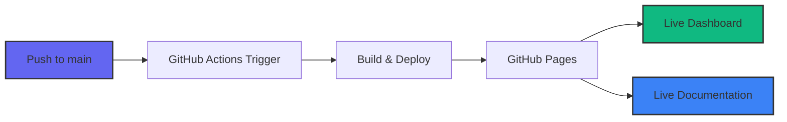

# GitHub Pages Setup Guide

Complete guide for deploying the GitHub Copilot Enterprise Dashboard to GitHub Pages.

## Table of Contents

- [Overview](#overview)
- [Automatic Deployment](#automatic-deployment)
- [Manual Setup](#manual-setup)
- [Custom Domain](#custom-domain)
- [Troubleshooting](#troubleshooting)

## Overview

The dashboard is configured for automatic deployment to GitHub Pages via GitHub Actions. Every push to the `main` branch will automatically deploy the latest version.

### URLs After Deployment

Once deployed, your dashboard will be available at:

- **Dashboard:** `https://kinncj.github.io/GitHub-Copilot-Enterprise-Dashboard/`
- **Documentation:** `https://kinncj.github.io/GitHub-Copilot-Enterprise-Dashboard/docs/`



## Automatic Deployment

### First-Time Setup

1. **Enable GitHub Pages in repository settings:**
   - Go to your repository on GitHub
   - Click **Settings** → **Pages**
   - Under **Source**, select **GitHub Actions**
   - Click **Save**

2. **Push your code:**
   ```bash
   git add .
   git commit -m "Initial commit with GitHub Pages support"
   git push origin main
   ```

3. **Wait for deployment:**
   - Go to **Actions** tab in your repository
   - Watch the "Deploy to GitHub Pages" workflow
   - Deployment typically takes 1-2 minutes

4. **Access your dashboard:**
   - Once complete, visit `https://kinncj.github.io/GitHub-Copilot-Enterprise-Dashboard/`
   - Your dashboard is now live! 🎉

### How It Works

The GitHub Actions workflow (`.github/workflows/deploy-pages.yml`) automatically:

1. Triggers on every push to `main` branch
2. Checks out your code
3. Configures GitHub Pages
4. Uploads the entire repository as an artifact
5. Deploys to GitHub Pages

**Files involved:**
- `.github/workflows/deploy-pages.yml` - GitHub Actions workflow
- `.nojekyll` - Bypasses Jekyll processing (for faster builds)
- `docs/_config.yml` - Documentation site configuration

## Manual Setup

If you prefer manual deployment or want to test locally first:

### Option 1: Deploy from Settings

1. **Go to repository Settings → Pages**
2. Under **Source**, select **Deploy from a branch**
3. Select **main** branch and **/ (root)** folder
4. Click **Save**

### Option 2: Use GitHub CLI

```bash
# Install GitHub CLI (if not installed)
brew install gh  # macOS
# or visit https://cli.github.com/

# Enable GitHub Pages
gh repo edit --enable-pages --pages-branch main

# Check deployment status
gh run list --workflow="pages-build-deployment"
```

## Custom Domain

To use a custom domain (e.g., `copilot-dashboard.yourcompany.com`):

### 1. Configure DNS

Add a CNAME record in your DNS provider:

```
Type: CNAME
Name: copilot-dashboard (or subdomain of your choice)
Value: kinncj.github.io
TTL: 3600
```

**Or for apex domain (yourcompany.com):**

```
Type: A
Name: @
Value: 185.199.108.153
       185.199.109.153
       185.199.110.153
       185.199.111.153
```

### 2. Add CNAME File

Create a `CNAME` file in the repository root:

```bash
echo "copilot-dashboard.yourcompany.com" > CNAME
git add CNAME
git commit -m "Add custom domain"
git push
```

### 3. Configure in GitHub

1. Go to **Settings → Pages**
2. Under **Custom domain**, enter: `copilot-dashboard.yourcompany.com`
3. Check **Enforce HTTPS** (wait a few minutes for certificate)
4. Click **Save**

### 4. Verify

```bash
# Check DNS propagation
dig copilot-dashboard.yourcompany.com

# Should show:
# copilot-dashboard.yourcompany.com. 3600 IN CNAME kinncj.github.io.
```

Visit `https://copilot-dashboard.yourcompany.com` - your dashboard is live!

## Deployment Options

### Deploy Specific Folder

If you want to deploy only the `docs/` folder as a separate documentation site:

**Update workflow:**

```yaml
- name: Upload artifact
  uses: actions/upload-pages-artifact@v3
  with:
    path: 'docs'  # Only deploy docs folder
```

**Result:**
- Documentation at: `https://kinncj.github.io/GitHub-Copilot-Enterprise-Dashboard/`
- Dashboard needs separate hosting

### Deploy Dashboard and Docs Separately

**Option A: Two separate repositories**
- `GitHub-Copilot-Enterprise-Dashboard` (main repo) - Dashboard
- `GitHub-Copilot-Enterprise-Dashboard-Docs` - Documentation

**Option B: Two branches**
- `main` branch - Source code
- `gh-pages` branch - Built dashboard
- `docs` branch - Documentation

## GitHub Pages Features

### Automatic Features

✅ **HTTPS** - Automatically enabled
✅ **CDN** - Global distribution via Fastly
✅ **Caching** - Aggressive caching for performance
✅ **Custom 404** - Add `404.html` for custom error page
✅ **Redirects** - Add `_redirects` file for URL redirects

### Performance

GitHub Pages serves static files with:
- **Global CDN** - Fast loading worldwide
- **HTTP/2** - Multiplexed connections
- **Compression** - Automatic gzip/brotli
- **Caching** - Browser and CDN caching

### Monitoring

**Check deployment status:**

```bash
# Via GitHub CLI
gh run list --workflow="Deploy to GitHub Pages"

# Via GitHub web interface
# Visit: https://github.com/kinncj/GitHub-Copilot-Enterprise-Dashboard/actions
```

**View site status:**

```bash
# Check if site is accessible
curl -I https://kinncj.github.io/GitHub-Copilot-Enterprise-Dashboard/

# Should return: HTTP/2 200
```

## Troubleshooting

### Deployment Fails

**Check workflow logs:**

1. Go to **Actions** tab
2. Click on failed workflow run
3. Expand failed step
4. Read error message

**Common issues:**

```yaml
# Issue: Permission denied
# Fix: Enable write permissions in Settings → Actions → General → Workflow permissions
# Select: "Read and write permissions"

# Issue: Pages not enabled
# Fix: Settings → Pages → Source → GitHub Actions

# Issue: Build fails
# Fix: Check .github/workflows/deploy-pages.yml syntax
```

### 404 Error After Deployment

**Symptoms:**
- Dashboard deployed successfully
- But getting 404 when accessing URL

**Solutions:**

1. **Check URL:**
   ```
   ✅ Correct: https://kinncj.github.io/GitHub-Copilot-Enterprise-Dashboard/
   ❌ Wrong:   https://kinncj.github.io/gh_enterprise_copilot_visualizer/
   ```
   Use the repository name in the URL

2. **Verify index.html exists:**
   ```bash
   # Should exist in repository root
   ls -la index.html
   ```

3. **Check deployment status:**
   - Go to **Actions** tab
   - Ensure "Deploy to GitHub Pages" completed successfully
   - Green checkmark = success

4. **Wait for propagation:**
   - First deployment can take 5-10 minutes
   - Subsequent deployments are faster (1-2 minutes)

### CDN Dependencies Not Loading

**Symptom:** Dashboard loads but no styles or charts

**Causes:**
- Content Security Policy (CSP) blocking CDN
- GitHub Pages is HTTPS, CDN links must also be HTTPS

**Fix:**

Verify all CDN links use HTTPS in `index.html`:

```html
✅ <script src="https://cdn.tailwindcss.com"></script>
❌ <script src="http://cdn.tailwindcss.com"></script>
```

### Custom Domain Not Working

**Checklist:**

- [ ] DNS CNAME record configured
- [ ] DNS propagated (check with `dig` or `nslookup`)
- [ ] CNAME file in repository root
- [ ] Custom domain entered in Settings → Pages
- [ ] HTTPS enforcement enabled (may take time)
- [ ] Wait 24-48 hours for SSL certificate

**Verify DNS:**

```bash
# Check CNAME
dig copilot-dashboard.yourcompany.com CNAME

# Check if pointing to GitHub
dig copilot-dashboard.yourcompany.com

# Should show GitHub Pages IPs:
# 185.199.108.153, 185.199.109.153, etc.
```

### Mermaid Diagrams Not Rendering

**GitHub Pages + Jekyll issue:**

GitHub Pages uses Jekyll by default, which may not render Mermaid.

**Solutions:**

1. **Bypass Jekyll (recommended):**
   - `.nojekyll` file already added ✅
   - Mermaid will render via browser JavaScript

2. **Use GitHub's native Mermaid:**
   - GitHub now supports Mermaid in Markdown
   - Diagrams render automatically in docs

3. **Add Mermaid JavaScript:**

   Add to docs layout if using custom theme:
   ```html
   <script type="module">
     import mermaid from 'https://cdn.jsdelivr.net/npm/mermaid@10/dist/mermaid.esm.min.mjs';
     mermaid.initialize({ startOnLoad: true });
   </script>
   ```

## Updating the Dashboard

After initial setup, updating is automatic:

```bash
# Make changes to index.html or docs/
git add .
git commit -m "Update dashboard features"
git push origin main

# GitHub Actions automatically deploys
# Wait 1-2 minutes
# Changes live at: https://kinncj.github.io/GitHub-Copilot-Enterprise-Dashboard/
```

### Cache Busting

If users see old version after update:

**Option 1: Hard refresh**
- Users press `Ctrl+Shift+R` (Windows/Linux)
- Or `Cmd+Shift+R` (Mac)

**Option 2: Versioning**

Add version query parameter:

```html
<!-- In index.html -->
<link rel="stylesheet" href="styles.css?v=1.0.1">
<script src="app.js?v=1.0.1"></script>
```

**Option 3: Service Worker**

Add caching strategy (advanced):

```javascript
// service-worker.js
self.addEventListener('fetch', event => {
    event.respondWith(
        caches.open('v1').then(cache => {
            return cache.match(event.request).then(response => {
                return response || fetch(event.request);
            });
        })
    );
});
```

## Analytics (Optional)

Track dashboard usage with GitHub Pages + Google Analytics:

1. **Get tracking ID** from Google Analytics

2. **Add to index.html** (before closing `</head>`):

```html
<!-- Google Analytics -->
<script async src="https://www.googletagmanager.com/gtag/js?id=G-XXXXXXXXXX"></script>
<script>
  window.dataLayer = window.dataLayer || [];
  function gtag(){dataLayer.push(arguments);}
  gtag('js', new Date());
  gtag('config', 'G-XXXXXXXXXX');
</script>
```

**Privacy note:** Inform users if adding analytics.

## Security

### HTTPS

GitHub Pages automatically provides HTTPS. **Always enforce HTTPS:**

- Settings → Pages → Enforce HTTPS ✅

### Content Security Policy

Add CSP meta tag for enhanced security:

```html
<meta http-equiv="Content-Security-Policy"
      content="default-src 'self';
               script-src 'self' 'unsafe-inline' https://cdn.tailwindcss.com https://cdn.jsdelivr.net https://unpkg.com;
               style-src 'self' 'unsafe-inline' https://cdn.tailwindcss.com;">
```

## GitHub Pages Limits

Be aware of GitHub Pages limits:

| Resource | Limit |
|----------|-------|
| Repository size | 1 GB (soft) |
| Published site size | 1 GB |
| Bandwidth | 100 GB/month |
| Builds | 10 per hour |

**For this dashboard:**
- Repository size: ~5 MB ✅
- Site size: ~70 KB ✅
- Bandwidth: Typical usage well under limit ✅

## Next Steps

After deployment:

1. **Share the URL** with your team
2. **Set up custom domain** (optional)
3. **Monitor usage** via GitHub Traffic (Insights → Traffic)
4. **Update dashboard** by pushing to main branch
5. **Add to README** - Update with live demo link

## Resources

- **GitHub Pages Docs:** https://docs.github.com/pages
- **GitHub Actions:** https://docs.github.com/actions
- **Custom Domains:** https://docs.github.com/pages/configuring-a-custom-domain-for-your-github-pages-site
- **Troubleshooting:** https://docs.github.com/pages/getting-started-with-github-pages/troubleshooting-404-errors-for-github-pages-sites

---

**Your dashboard is ready for the world!** 🚀

Visit: `https://kinncj.github.io/GitHub-Copilot-Enterprise-Dashboard/`
