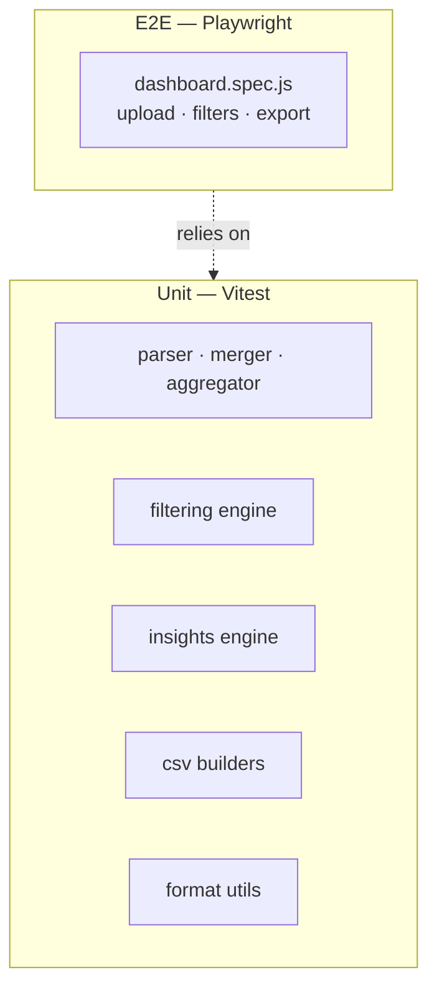

# Testing

## Test stack

| Layer | Tool | Config |
|-------|------|--------|
| Unit | [Vitest](https://vitest.dev) | `vitest.config.js` |
| E2E | [Playwright](https://playwright.dev) | `playwright.config.js` |

## Running tests

```bash
make test        # unit tests only
make test-e2e    # playwright (requires dev server or runs it automatically)
make test-all    # both
make coverage    # unit tests + coverage report → coverage/
```

---

## Unit test layout

Tests mirror the source tree under `tests/unit/`:

```
tests/unit/
  domain/
    config/          # (constants are trivial — tested via consumers)
    data/
      parser.test.js      # normalizeRecord, parseNDJSON
      merger.test.js      # mergeRecords
      aggregator.test.js  # aggregateData (all 6 dimensions)
    filtering/
      engine.test.js      # filterRecords, quickRangeDates, extractFilterOptions
    insights/
      engine.test.js      # generateInsights (all 5 insight types)
    export/
      csv.test.js         # all buildXxxCSV functions
  common/
    utils/
      format.test.js      # formatNumber, humanizeFeature
```

Domain tests run in Node — no browser, no DOM. Every domain function takes plain data as arguments and returns plain data back, so there's nothing to mock.

---

## E2E test layout

```
tests/e2e/
  dashboard.spec.js   # upload → KPIs · filters · insights · table · export menu
```

The e2e tests use an in-memory NDJSON fixture (a small `Buffer` passed to `setInputFiles`) so no real data files are needed on CI.

Playwright is configured for Chromium only (`playwright.config.js`). The dev server starts automatically via `webServer` config if nothing is already listening on port 3000.

---

## Test pyramid



Most of the interesting logic is at the unit layer. E2E tests check that the wiring between domain and presentation is correct — they don't re-test every business rule.

---

## Writing a new unit test

1. Add a file at `tests/unit/domain/<area>/<module>.test.js`.
2. Import directly from the source module — no mocking needed (domain functions are pure).
3. Use a `record()` factory function to build test fixtures, with `overrides` for the fields under test.

```javascript
import { describe, it, expect } from 'vitest';
import { myFunction } from '../../../../app/domain/<area>/<module>.js';

function record(overrides = {}) {
  return {
    user_login: 'alice',
    day: '2025-01-01',
    // ... defaults ...
    ...overrides
  };
}

describe('myFunction', () => {
  it('does the right thing', () => {
    const result = myFunction([record({ someField: 42 })]);
    expect(result).toEqual(/* expected */);
  });
});
```

## Writing a new e2e test

```javascript
import { test, expect } from '@playwright/test';

test('my scenario', async ({ page }) => {
  await page.goto('/');
  // upload sample data using the SAMPLE_NDJSON Buffer helper (see dashboard.spec.js)
  await expect(page.locator('#someElement')).toBeVisible();
});
```

Keep e2e tests coarse — they should verify user-visible outcomes, not implementation details.
