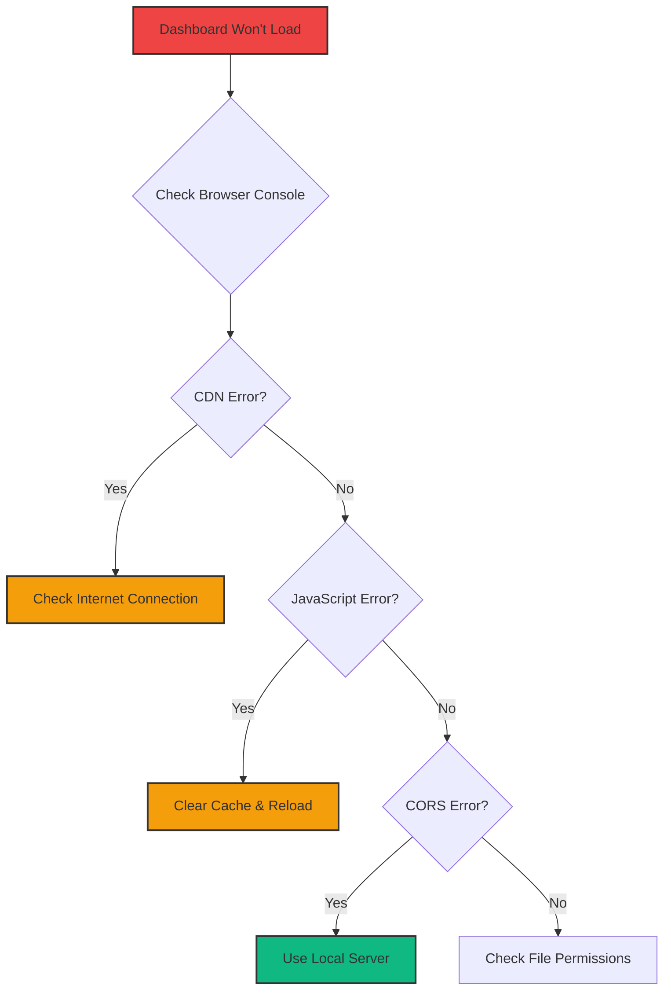
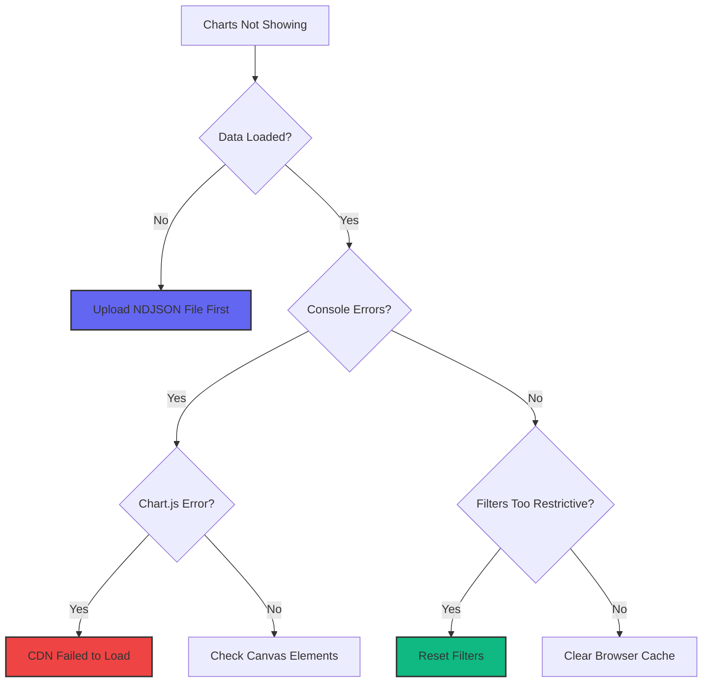
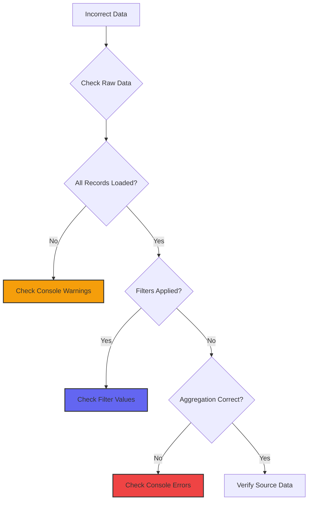

# Troubleshooting

Solutions to common issues and problems with the GitHub Copilot Enterprise Dashboard.

## Table of Contents

- [Common Issues](#common-issues)
- [File Upload Problems](#file-upload-problems)
- [Data Display Issues](#data-display-issues)
- [Performance Issues](#performance-issues)
- [Browser Compatibility](#browser-compatibility)
- [Deployment Issues](#deployment-issues)
- [Debug Tools](#debug-tools)

## Common Issues

### Dashboard Won't Load

**Symptom:** Blank page or "Page cannot be displayed"



**Solutions:**

1. **Check browser console (F12):**
   ```
   Failed to load resource: net::ERR_INTERNET_DISCONNECTED
   ```
   → **Solution:** Check internet connection (CDN dependencies need network)

2. **CDN blocked by firewall:**
   ```
   Refused to load script from 'https://cdn.tailwindcss.com'
   ```
   → **Solution:** Configure firewall to allow:
   - `cdn.tailwindcss.com`
   - `cdn.jsdelivr.net`
   - `unpkg.com`

3. **CORS error when opening locally:**
   ```
   Access to XMLHttpRequest blocked by CORS policy
   ```
   → **Solution:** Use local web server:
   ```bash
   python3 -m http.server 8000
   # Then open http://localhost:8000
   ```

### Charts Not Displaying

**Symptom:** Empty chart areas or "Cannot read property 'getContext' of null"

**Diagnostic Steps:**



**Solutions:**

1. **Chart.js not loaded:**
   ```javascript
   // Check in console:
   typeof Chart
   // Should return "function", not "undefined"
   ```
   → **Solution:** Verify CDN connection, check console for 404 errors

2. **Canvas elements missing:**
   ```javascript
   // Check in console:
   document.getElementById('activityChart')
   // Should return canvas element, not null
   ```
   → **Solution:** Ensure HTML structure is intact, check for JavaScript errors

3. **No data after filters:**
   - Check filter dropdowns
   - Reset date range to "All Time"
   - Click "Clear Filters" if available

4. **Chart memory leak:**
   ```javascript
   // Too many chart instances
   Object.keys(state.charts).length  // Should be <= 9
   ```
   → **Solution:** Reload page to clear old chart instances

## File Upload Problems

### "Invalid File Format" Error

**Symptom:** Error message when uploading file

**Checklist:**

- [ ] File extension is `.ndjson` or `.json`
- [ ] File is valid NDJSON (one JSON object per line)
- [ ] Each line is valid JSON
- [ ] No commas between lines
- [ ] Records contain required fields

**Validation Test:**

```bash
# Test if file is valid NDJSON
head -n 1 yourfile.ndjson | jq .
# Should output formatted JSON without errors

# Check for required fields
head -n 1 yourfile.ndjson | jq '{user_login, day, code_generation_activity_count}'
# Should show these three fields
```

**Common Format Issues:**

```json
// ❌ WRONG: JSON array
[
  {"user_login": "alice", ...},
  {"user_login": "bob", ...}
]

// ❌ WRONG: Commas between lines
{"user_login": "alice", ...},
{"user_login": "bob", ...}

// ✅ CORRECT: NDJSON
{"user_login": "alice", ...}
{"user_login": "bob", ...}
```

### File Upload Freezes Browser

**Symptom:** Browser becomes unresponsive during large file upload

**Expected Behavior:**
- Files up to 50MB: Should parse smoothly
- Files 50-100MB: May show warning, but should work
- Files >100MB: Warning displayed, longer parse time

**Solutions:**

1. **Reduce chunk size for very large files:**
   ```javascript
   // In CONFIG object
   CHUNK_SIZE: 5000  // Instead of default 10000
   ```

2. **Pre-filter data before upload:**
   ```bash
   # Keep only last 30 days
   awk -v date="$(date -d '30 days ago' +%Y-%m-%d)" \
       '$0 ~ "\"day\":\""date {p=1} p' data.ndjson > filtered.ndjson
   ```

3. **Split large files:**
   ```bash
   # Split into 10MB chunks
   split -b 10m large-file.ndjson chunk-
   # Upload chunks separately
   ```

### Upload Progress Stuck

**Symptom:** Progress bar stops before completion

**Diagnostic:**

```javascript
// Check in browser console
console.log('Raw data records:', state.rawData.length);
console.log('Last record:', state.rawData[state.rawData.length - 1]);
```

**Solutions:**

1. **Malformed line in file:**
   - Check console for parsing errors
   - Look for line number in error message
   - Fix or remove problematic line

2. **Memory limit reached:**
   - Close other browser tabs
   - Restart browser
   - Reduce file size

## Data Display Issues

### Missing or Incorrect Data

**Symptom:** Charts show unexpected values or missing data

**Debugging Decision Tree:**



**Verification Steps:**

1. **Check raw data count:**
   ```javascript
   console.log('Total records:', state.rawData.length);
   console.log('Filtered records:', state.filteredData.length);
   ```

2. **Inspect sample records:**
   ```javascript
   console.table(state.rawData.slice(0, 5));
   ```

3. **Verify aggregations:**
   ```javascript
   console.log('Total generations:', state.aggregatedData.totals.totalGenerations);
   console.log('Unique users:', state.aggregatedData.totals.uniqueUsers);
   ```

4. **Check for data quality warnings:**
   - Open browser console (F12)
   - Look for yellow warning messages
   - Common warnings:
     - "Skipping record with missing user_login"
     - "Invalid date format: [value]"
     - "Acceptances exceed generations"

### Acceptance Rate Seems Wrong

**Common Causes:**

1. **Insufficient data:**
   - Users with <50 generations excluded from "Top by Acceptance" chart
   - Adjust `CONFIG.MIN_GENERATIONS_FOR_RATE`

2. **Zero generations:**
   ```javascript
   // Check for division by zero
   state.filteredData.filter(r => r.generations === 0).length
   ```

3. **Acceptance > Generations (data error):**
   - Parser should skip these records
   - Check console for warnings

**Validation:**

```javascript
// Find records with acceptance rate > 100%
state.rawData.filter(r =>
    r.code_acceptance_activity_count > r.code_generation_activity_count
).forEach(r => {
    console.warn('Invalid record:', r.user_login, r.day);
});
```

### Date Range Filter Not Working

**Symptom:** Date filter doesn't narrow results

**Checks:**

1. **Verify date format:**
   ```javascript
   console.log('Start:', state.filters.startDate);
   console.log('End:', state.filters.endDate);
   // Both should be Date objects, not strings
   ```

2. **Check record dates:**
   ```javascript
   state.rawData.forEach(r => {
       if (!(r.dateObj instanceof Date)) {
           console.error('Invalid date for:', r.user_login, r.day);
       }
   });
   ```

3. **Ensure filter is applied:**
   ```javascript
   // After changing dates, this should be called:
   applyFilters();
   ```

## Performance Issues

### Slow Chart Rendering

**Symptom:** Charts take several seconds to render or update

**Performance Metrics:**

```javascript
// Add timing
console.time('renderCharts');
renderCharts();
console.timeEnd('renderCharts');
// Should complete in < 1 second for typical datasets
```

**Optimization Checklist:**

- [ ] Reduce `CHART_ANIMATION_DURATION` to 0 or 300
- [ ] Limit chart data points (e.g., top 10 users instead of all)
- [ ] Reduce `MAX_TABLE_ROWS` if table is slow
- [ ] Close browser DevTools (can slow rendering)

**Solutions:**

1. **Disable animations:**
   ```javascript
   CONFIG.CHART_ANIMATION_DURATION = 0;
   ```

2. **Reduce chart data:**
   ```javascript
   CONFIG.MAX_TOP_USERS_SHOWN = 10;  // Instead of 15
   CONFIG.MAX_LANGUAGES_SHOWN = 5;   // Instead of 10
   ```

3. **Aggregate by week instead of day:**
   ```javascript
   // Custom modification to aggregateData()
   // Group by week instead of individual days
   ```

### Memory Leak / Page Becomes Slow

**Symptom:** Dashboard gets slower over time, especially after multiple file uploads

**Diagnosis:**

```javascript
// Check chart instances
console.log('Active charts:', Object.keys(state.charts).length);
// Should be <= 9

// Check data size
console.log('Raw data size:', state.rawData.length);
console.log('Memory usage:', performance.memory?.usedJSHeapSize);
```

**Solutions:**

1. **Reload page between uploads:**
   - Simplest solution for now
   - Clears all state and chart instances

2. **Destroy old charts properly:**
   ```javascript
   // Ensure this runs before creating new charts
   Object.values(state.charts).forEach(chart => {
       if (chart) chart.destroy();
   });
   state.charts = {};
   ```

3. **Clear state on new upload:**
   ```javascript
   function handleFileUpload(event) {
       // Clear existing state
       state.rawData = [];
       state.filteredData = [];
       state.aggregatedData = {};

       // Destroy charts
       Object.values(state.charts).forEach(chart => chart?.destroy());
       state.charts = {};

       // Continue with upload...
   }
   ```

## Browser Compatibility

### Safari Issues

**Issue:** Charts not rendering or partial functionality

**Solutions:**

1. **Enable JavaScript:**
   - Safari → Preferences → Security → Enable JavaScript

2. **Disable tracking prevention for localhost:**
   - Safari → Preferences → Privacy
   - Uncheck "Prevent cross-site tracking" for development

3. **Clear cache:**
   - Safari → Develop → Empty Caches
   - If "Develop" menu not visible: Preferences → Advanced → Show Develop menu

### Internet Explorer

**Status:** ❌ Not Supported

**Reason:** Dashboard uses ES6+ JavaScript features

**Alternative:** Use Edge, Chrome, Firefox, or Safari

### Mobile Browsers

**Partial Support:**

| Feature | Mobile Support | Notes |
|---------|----------------|-------|
| File upload | ✅ Works | May be slower on large files |
| Charts | ✅ Works | Smaller screen, consider scrolling |
| Filters | ✅ Works | Dropdowns work fine |
| Export CSV | ✅ Works | Download location varies by browser |
| Touch gestures | ⚠️ Limited | Chart hover requires tap |

**Recommendations:**
- Use desktop browser for best experience
- Reduce file size for mobile uploads
- Landscape orientation recommended

## Deployment Issues

### 404 Error After Deployment

**Symptom:** Deployed dashboard shows "404 Not Found"

**Checks:**

1. **Verify file path:**
   ```bash
   # Should return the file
   curl https://your-domain.com/index.html
   ```

2. **Check web server configuration:**
   - Nginx: Ensure `root` directive points to correct directory
   - Apache: Check `DocumentRoot` in virtual host
   - S3: Verify bucket policy allows public read

3. **File permissions:**
   ```bash
   # Should be readable
   ls -la index.html
   # Should show: -rw-r--r--
   ```

### HTTPS Certificate Errors

**Symptom:** Browser shows "Not Secure" or certificate warning

**Solutions:**

1. **Use Let's Encrypt (free):**
   ```bash
   certbot --nginx -d copilot-dashboard.company.com
   ```

2. **Check certificate validity:**
   ```bash
   openssl s_client -connect copilot-dashboard.company.com:443 -servername copilot-dashboard.company.com
   ```

3. **Verify HTTPS redirect:**
   ```bash
   curl -I http://copilot-dashboard.company.com
   # Should return: HTTP/1.1 301 Moved Permanently
   # Location: https://copilot-dashboard.company.com
   ```

### CDN Dependencies Not Loading

**Symptom:** Unstyled page or missing functionality

**Diagnosis:**

```javascript
// Check in browser console
typeof Chart !== 'undefined'  // Chart.js loaded
typeof lucide !== 'undefined'  // Lucide loaded
```

**Solutions:**

1. **Check CSP headers:**
   - Open DevTools → Network
   - Look for blocked requests
   - Update Content-Security-Policy header

2. **Self-host dependencies:**
   ```html
   <!-- Download and host locally -->
   <script src="/assets/chart.min.js"></script>
   <script src="/assets/lucide.min.js"></script>
   ```

3. **Use alternative CDN:**
   ```html
   <!-- Instead of cdn.jsdelivr.net -->
   <script src="https://unpkg.com/chart.js@4.4.1/dist/chart.umd.min.js"></script>
   ```

## Debug Tools

### Browser DevTools Console

**Essential commands:**

```javascript
// 1. Check state
state

// 2. View raw data
state.rawData.slice(0, 10)

// 3. View aggregations
state.aggregatedData.totals

// 4. Test functions
applyFilters()
renderDashboard()

// 5. Performance profiling
console.time('operation');
// ... code to test ...
console.timeEnd('operation');

// 6. Memory usage (Chrome only)
performance.memory.usedJSHeapSize / 1048576 + ' MB'
```

### Network Tab

**What to check:**

1. **CDN loading:**
   - All requests to `cdn.tailwindcss.com`, `cdn.jsdelivr.net`, `unpkg.com` should be 200 OK
   - Check size and load time

2. **No unexpected requests:**
   - Dashboard should NOT make API calls after initial load
   - If you see POST/PUT requests, investigate

### Performance Tab

**Profile rendering:**

1. Open DevTools → Performance
2. Click Record
3. Upload file or change filter
4. Stop recording
5. Analyze:
   - Scripting time should be < 1s
   - Rendering time should be < 500ms
   - Look for long tasks (>50ms)

### Memory Tab (Chrome)

**Detect memory leaks:**

1. Open DevTools → Memory
2. Take heap snapshot
3. Upload file, render dashboard
4. Take another snapshot
5. Compare:
   - Chart instances should be cleaned up
   - No excessive retained objects

## Getting Help

### Before Asking for Help

**Gather this information:**

1. **Environment:**
   - Browser and version
   - Operating system
   - Dashboard version/commit hash

2. **Steps to reproduce:**
   - Exact actions taken
   - Expected behavior
   - Actual behavior

3. **Console output:**
   - Copy error messages
   - Include warnings
   - Screenshot if helpful

4. **Data info:**
   - File size
   - Number of records
   - Date range

### Reporting Issues

**On GitHub:**

1. Go to [Issues](https://github.com/kinncj/GitHub-Copilot-Enterprise-Dashboard/issues)
2. Search for existing issue
3. If not found, create new issue with template:

```markdown
**Environment:**
- Browser: Chrome 120
- OS: macOS 14
- Dashboard: v1.0

**Issue:**
Charts not rendering after file upload

**Steps to Reproduce:**
1. Open index.html
2. Upload 50MB NDJSON file
3. Charts remain empty

**Expected:**
Charts should display data

**Actual:**
Empty chart containers, no errors in console

**Console Output:**
```
[paste console output]
```

**Additional Context:**
File has 100k records, date range 2023-01-01 to 2024-01-31
```

### Community Resources

- **Documentation:** `/docs` folder
- **Issues:** [GitHub Issues](https://github.com/kinncj/GitHub-Copilot-Enterprise-Dashboard/issues)
- **Discussions:** [GitHub Discussions](https://github.com/kinncj/GitHub-Copilot-Enterprise-Dashboard/discussions)

## Quick Fixes Summary

| Problem | Quick Fix |
|---------|-----------|
| Blank page | Check console, verify CDN loading |
| Charts missing | Upload data file first, check filters |
| Slow performance | Reduce `CHUNK_SIZE` and animation duration |
| File won't upload | Verify NDJSON format, check file size |
| Date filter not working | Clear cache, check date format |
| Memory leak | Reload page between uploads |
| CORS error | Use local web server (`python3 -m http.server`) |
| 404 after deploy | Verify file path and web server config |

## Next Steps

- **[Configuration](./configuration.md)** - Adjust settings
- **[Development](./development.md)** - Extend functionality
- **[API Reference](./api-reference.md)** - Function documentation
